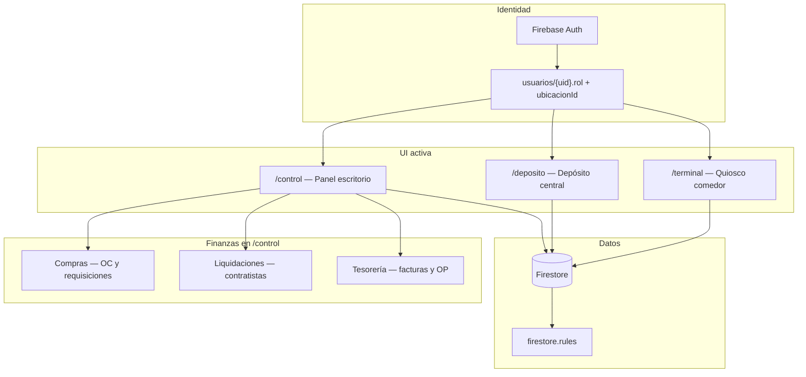
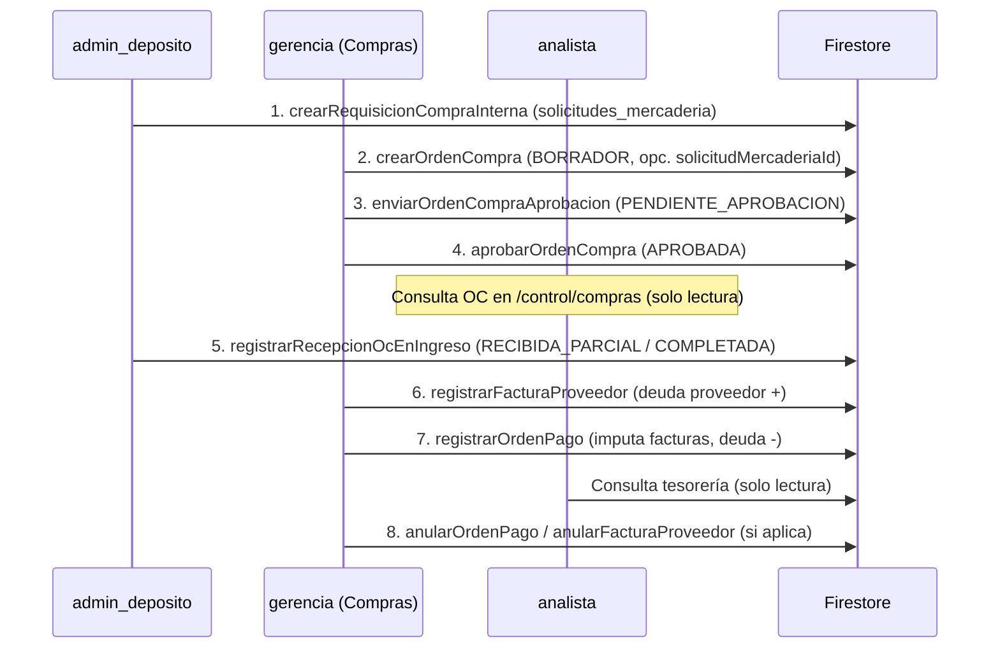
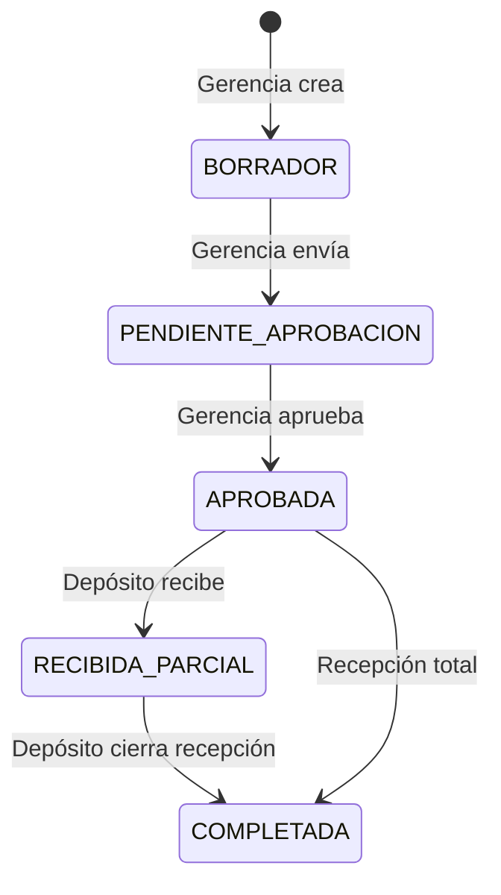
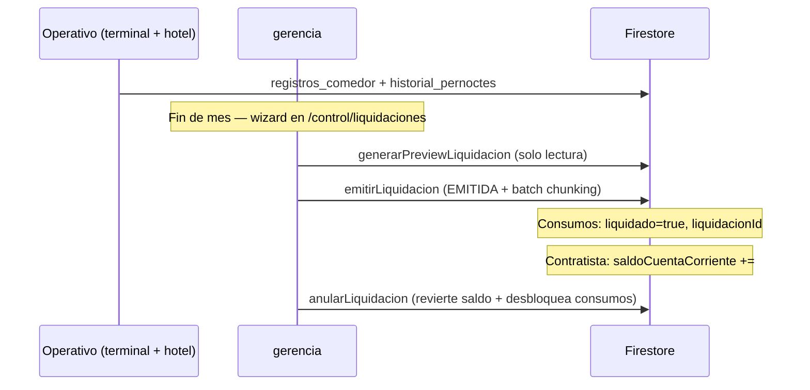
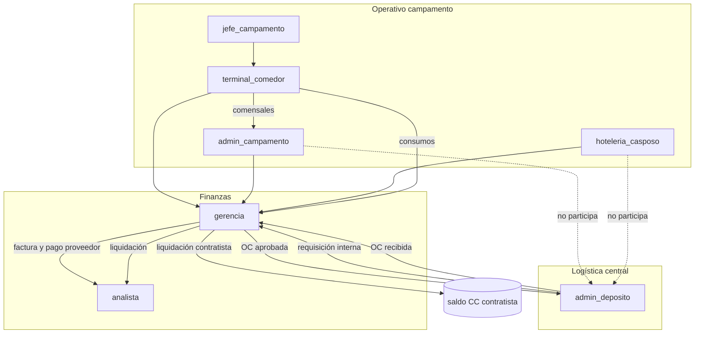

# Arquitectura de la aplicación — Roles, módulos e interacciones

Documento de referencia del sistema **Cocina Industrial**: roles, rutas activas, flujos entre áreas y estado del MVP.

**Fuentes:** `src/App.tsx`, `src/lib/rbac.ts`, `src/context/AuthContext.tsx`, `firestore.rules`, `docs/MODULO_A_COMPRAS.md`, `docs/MODULO_B_TESORERIA.md`, `docs/MODULO_C_FACTURACION.md`.

---

## 1. Visión general

La aplicación cubre **comedor + hotelería de campamento** (MVP operativo), **depósito central** (requisiciones + recepción OC), y **finanzas** en tres módulos para `gerencia`/`analista`:

| Módulo | Área | Sentido del flujo |
|--------|------|-------------------|
| **A — Compras** | Cuentas por pagar (proveedores) | Depósito pide → Gerencia compra → Depósito recibe |
| **B — Tesorería** | Pagos a proveedores | Factura OC → Orden de pago |
| **C — Liquidaciones** | Cuentas por cobrar (contratistas) | Consumos operativos → Pre-factura mensual |

Módulos de cocina central, campamento logístico y BI analista siguen en código pero **sin rutas montadas**.



### Capas de autorización

| Capa | Qué controla |
|------|----------------|
| **Firebase Auth** | Identidad (email/contraseña; anónimo solo en código legacy) |
| **`usuarios/{uid}`** | Rol obligatorio para staff; sin rol válido → logout |
| **`ProtectedRoute`** | Rutas visibles por rol (incluye sub-rutas anidadas en `/control`) |
| **`firestore.rules`** | Autorización real de lectura/escritura por colección |
| **Sidebar / UI** | Oculta acciones (ej. analista solo lectura en Tesorería) |

---

## 2. Roles del sistema

Definidos en `src/context/AuthContext.tsx` (`UserRole`). **No se crearon roles nuevos** para Compras/Tesorería: se reutilizan `admin_deposito`, `gerencia` y `analista`.

| Rol | Valor Firestore | Home post-login | Estado MVP |
|-----|-----------------|-----------------|------------|
| Admin depósito | `admin_deposito` | `/deposito` | **Activo** |
| Admin campamento | `admin_campamento` | `/control` | Activo |
| Hotelería Casposo | `hoteleria_casposo` | `/control` | Activo |
| Gerencia | `gerencia` | `/control` | Activo (+ Finanzas escritura) |
| Analista | `analista` | `/control` | Activo (+ Finanzas lectura) |
| Jefe campamento | `jefe_campamento` | `/terminal` | Activo (solo terminal) |
| Terminal comedor | `terminal_comedor` | `/terminal` | Activo |
| Admin cocina | `admin_cocina` | — | **Bloqueado** en login |
| Cliente anónimo | *(sin rol)* | — | Ruta pública desactivada |

**Ubicación default (`ubicacionId`):**

| Rol | Default si no viene en documento |
|-----|----------------------------------|
| `admin_deposito` | `CENTRAL` |
| `admin_campamento`, `hoteleria_casposo`, `jefe_campamento` | `CASPOSO` |
| `admin_cocina` | `COCINA` |
| `gerencia`, `analista` | solo lo del documento (visión global) |

### Constantes RBAC (`src/lib/rbac.ts`)

| Constante | Roles |
|-----------|-------|
| `ROLES_PANEL_CONTROL` | `admin_campamento`, `hoteleria_casposo`, `gerencia`, `analista` |
| `ROLES_DEPOSITO` | `admin_deposito` |
| `ROLES_TERMINAL_CAMPO` | `jefe_campamento`, `terminal_comedor` |
| `ROLES_TESORERIA` | `gerencia`, `analista` |
| `ROLES_VISION_GLOBAL_LECTURA` | `gerencia`, `analista` |
| `ROLES_PANEL_CONTROL_ESCRITURA` | los 4 del panel control |

---

## 3. Módulos activos (rutas montadas)

### 3.1 Panel `/control` — Operaciones (Comensales + Hotelería)

**Roles:** `admin_campamento`, `hoteleria_casposo`, `gerencia`, `analista`

**Menú:** `ControlSidebar.tsx` — sección operativa igual para los 4; sección **Finanzas** solo para `gerencia` y `analista`.

| Ruta | Módulo | Escritura |
|------|--------|-----------|
| `/control` | Dashboard Comensales | Todos los del panel |
| `/control/hoteleria` | Dashboard Hotelería | Todos |
| `/control/padron` | Padrón personas | Todos |
| `/control/empresas` | Padrón empresas | Todos |
| `/control/alojamiento` | Mapa de camas | Todos |
| `/control/reporte-limpieza` | Auditoría limpieza | Todos |
| `/control/facturacion` | Facturación operativa (comedor + hotelería) | Todos |
| `/control/configuracion` | Config. hotelería | Todos |

---

### 3.2 Panel `/control` — Finanzas (Módulos A + B + C)

**Roles ruta:** `gerencia`, `analista` (sub-`ProtectedRoute`)

| Ruta | Módulo | `gerencia` | `analista` |
|------|--------|:----------:|:----------:|
| `/control/compras` | Bandeja comprador (requisiciones + OC) | Crear/enviar/aprobar OC | Solo lectura |
| `/control/liquidaciones` | Cuentas por cobrar — liquidaciones contratistas | Emitir y anular | Solo lectura |
| `/control/tesoreria` | Cuentas por pagar — proveedores | Facturas, OP, anulaciones | Solo lectura |

**Archivos clave:**

- `src/views/control/ComprasAprobacionPage.tsx`
- `src/views/control/LiquidacionesPage.tsx`
- `src/views/control/TesoreriaDashboardPage.tsx`
- `src/lib/ordenesCompra.ts`, `src/lib/facturacion.ts`, `src/lib/tesoreria.ts`
- `src/components/compras/*`, `src/components/tesoreria/*`

**Docs detalladas:** `docs/MODULO_A_COMPRAS.md`, `docs/MODULO_B_TESORERIA.md`, `docs/MODULO_C_FACTURACION.md`

---

### 3.3 Depósito `/deposito` — Inventario + Compras

**Rol:** `admin_deposito`

**Menú:** `DepositoSidebar.tsx`

| Ruta | Función |
|------|---------|
| `/deposito/dashboard` | Resumen operativo |
| `/deposito/insumos` | Catálogo de insumos |
| `/deposito/movimientos` | Ingresos / egresos / ajustes **manuales** (sin OC) |
| `/deposito/ordenes-compra` | **Requisiciones** internas + **OC entrantes** (lectura + recepción) |
| `/deposito/inventario` | Stock por lote |
| `/deposito/trazabilidad` | Trazabilidad |
| `/deposito/configuracion` | Configuración depósito |

**Archivos clave:**

- `src/views/deposito/DepositoOrdenesCompraPage.tsx`
- `src/components/compras/NuevaRequisicionCompraModal.tsx`, `RecepcionOcModal.tsx`
- `src/views/control/ComprasAprobacionPage.tsx` + `NuevaOrdenCompraModal.tsx` (comprador gerencia)

> **Importante:** La recepción vinculada a OC se hace en **Requisiciones y OC → pestaña OC entrantes → Recibir**, no en Movimientos sueltos.

---

### 3.4 Terminal `/terminal` — Quiosco comensales

**Roles:** `jefe_campamento`, `terminal_comedor`

| Función | Detalle |
|---------|---------|
| Registro por QR / DNI | TerminalComensalesPage |
| Modo offline | Cola local + sync |
| Restricción | Solo **create** en `registros_comedor` |

---

## 4. Flujo inter-roles — Cómo se conecta cada área

Este es el **circuito de negocio principal** entre roles. Cada paso depende del anterior.

### 4.1 Cadena Compras → Recepción → Tesorería



| Paso | Quién | Qué hace | UI | Backend |
|:----:|-------|----------|-----|---------|
| 1 | **Depósito** | Pide mercadería (requisición interna) | `/deposito/ordenes-compra` → Nueva requisición | `crearRequisicionCompraInterna()` |
| 2 | **Gerencia** | Elige proveedor y emite OC | `/control/compras` → Solicitudes / Nueva OC | `crearOrdenCompra()` |
| 3 | **Gerencia** | Envía a aprobación | Enviar a aprobación | `enviarOrdenCompraAprobacion()` |
| 4 | **Gerencia** | Aprueba compra | Aprobar | `aprobarOrdenCompra()` |
| 4b | **Analista** | Supervisa bandeja | `/control/compras` (sin botones) | lectura Firestore |
| 5 | **Depósito** | Recibe mercadería física | OC entrantes → Recibir | `registrarRecepcionOcEnIngreso()` |
| 6 | **Gerencia** | Registra factura del proveedor | `/control/tesoreria` → Nueva factura | `registrarFacturaProveedor()` |
| 7 | **Gerencia** | Emite pago e imputa facturas | Nueva orden de pago | `registrarOrdenPago()` |
| 8 | **Gerencia** | Anula OP o factura (orden: primero OP) | Acciones en tablas | `anularOrdenPago()` / `anularFacturaProveedor()` |
| 8b | **Analista** | Consulta saldos y pagos | Tesorería sin acciones | lectura Firestore |

**Estados OC:**



**Prerrequisito proveedor (Firestore `padron_empresas`):** para aprobar OC y operar tesorería, el proveedor debe tener `roles: ["PROVEEDOR"]`, `proveedorActivo: true` y CUIT cargado.

---

### 4.2 Cadena Comedor + Hotelería → Facturación operativa y Liquidaciones

Dos capas complementarias sobre los mismos datos operativos:

| Capa | UI | Propósito |
|------|-----|-----------|
| **Facturación operativa** | `/control/facturacion` | Sábana por DNI (cantidades) → export Excel |
| **Liquidaciones (Módulo C)** | `/control/liquidaciones` | Pre-factura por empresa contratista → deuda en cuenta corriente |

```mermaid
flowchart LR
  TERM[terminal_comedor] -->|registros_comedor| FS[(Firestore)]
  CTRL[panel /control] -->|historial_pernoctes camas| FS
  FS --> FACT[/control/facturacion]
  FACT -->|Excel cantidades| EXT[Contabilidad externa]
  FS --> LIQ[/control/liquidaciones]
  LIQ -->|emitir LIQ-AAAA-NNNNNN| CC[padron_empresas.saldoCuentaCorriente]
```



| Paso | Quién | Qué hace | Backend |
|:----:|-------|----------|---------|
| 1 | Terminal / hotelería | Registra consumos sin bloqueo | create en colecciones operativas |
| 2 | **Gerencia** | Preview agrupado por empresa y período | `generarPreviewLiquidacion()` |
| 3 | **Gerencia** | Emite liquidación definitiva | `emitirLiquidacion()` — transacción + batches ≤450 ops |
| 4 | **Gerencia** | Anula liquidación emitida | `anularLiquidacion()` — revierte CC + desbloquea consumos |
| 4b | **Analista** | Consulta historial | lectura Firestore |

**Estados liquidación:** `BORRADOR` (preview en memoria) → `EMITIDA` (bloquea consumos) → `ANULADA` (reversa).

| Rol | Aporta datos | Rol que consolida |
|-----|--------------|-------------------|
| `terminal_comedor` | Consumos del día (QR/DNI) | — |
| `admin_campamento`, `hoteleria_casposo` | Camas, pernoctes, padrón | — |
| `gerencia`, `analista` | Export operativo | `/control/facturacion` (cantidades) |
| `gerencia` | Emite pre-facturas | `/control/liquidaciones` |
| `analista` | Supervisa liquidaciones | `/control/liquidaciones` (lectura) |

---

### 4.3 Mapa de dependencias entre roles



---

## 5. Funciones por rol — Resumen ejecutivo

### `admin_deposito`

| Ámbito | Funciones |
|--------|-----------|
| **UI** | `/deposito/*` |
| **Compras** | Crear requisición interna, consultar OC entrantes, recepcionar OC aprobada |
| **Inventario** | Catálogo insumos, movimientos manuales, stock, trazabilidad |
| **No puede** | Crear OC, aprobar OC, registrar facturas, emitir OP, panel comedor/hotel |
| **Espera de** | Gerencia emite y aprueba OC antes de recepcionar |
| **Entrega a** | Gerencia OC en estado recibida para facturación |

---

### `gerencia`

| Ámbito | Funciones |
|--------|-----------|
| **UI** | `/control/*` completo + Finanzas (escritura) |
| **Operativo** | Mismas pantallas que campamento/hotel (comensales, camas, padrón, facturación export) |
| **Compras** | Atender requisiciones, crear OC, enviar y aprobar |
| **Liquidaciones** | Preview, emitir y anular pre-facturas a contratistas |
| **Tesorería** | Facturas proveedor, órdenes de pago, anulaciones |
| **No puede** | Recepcionar en depósito (rol distinto) |
| **Espera de** | Depósito envía requisición y recepciona; operativo registra consumos antes de liquidar |
| **Legacy inactivo** | `/analista/*` (BI logístico) |

---

### `analista`

| Ámbito | Funciones |
|--------|-----------|
| **UI** | `/control/*` + Finanzas **solo lectura** |
| **Operativo** | Igual que gerencia en panel (incluye escritura padrón/camas según reglas) |
| **Compras / Tesorería / Liquidaciones** | Consulta bandejas; sin emitir, aprobar ni anular |
| **No puede** | Aprobar OC, crear facturas, emitir/anular OP |
| **Legacy inactivo** | `/analista/*` (dashboard financiero logístico) |

---

### `admin_campamento`

| Ámbito | Funciones |
|--------|-----------|
| **UI** | `/control/*` (sin Finanzas en menú) |
| **Operativo** | Comensales (carga supervisor), hotelería, padrón, facturación export |
| **No participa** | Compras, tesorería, depósito |
| **Legacy inactivo** | `/campamento/*` (recepción traslados, comandas) |

---

### `hoteleria_casposo`

| Ámbito | Funciones |
|--------|-----------|
| **UI** | `/control/*` (sin Finanzas) |
| **Enfoque** | Camas, pernoctes, limpieza, padrón, facturación |
| **No participa** | Compras, tesorería, depósito |

---

### `jefe_campamento`

| Ámbito | Funciones |
|--------|-----------|
| **UI MVP** | Solo `/terminal` |
| **Firestore** | Permisos amplios (supervisor, hotelería) pero **no** `/control` ni `/deposito` |
| **Discrepancia** | Backend permite más de lo que la UI MVP expone |

---

### `terminal_comedor`

| Ámbito | Funciones |
|--------|-----------|
| **UI** | `/terminal` |
| **Función** | Registro comensales (QR/manual/offline) |
| **No participa** | Resto del sistema |

---

### `admin_cocina`

| Ámbito | Funciones |
|--------|-----------|
| **UI MVP** | Login bloqueado (`rutaHomePorRol` → null) |
| **Legacy** | `/admin/*` (menú, pedidos, recetario, solicitudes a depósito) |
| **Conexión futura** | Solicitaría mercadería a `admin_deposito` vía `solicitudes_mercaderia` |

---

## 6. Matriz UI — Qué ve cada rol en el menú

| Ítem menú | admin_deposito | admin_campamento | hoteleria | gerencia | analista | terminal |
|-----------|:---:|:---:|:---:|:---:|:---:|:---:|
| Panel comensales/hotel | — | ✅ | ✅ | ✅ | ✅ | — |
| Facturación operativa | — | ✅ | ✅ | ✅ | ✅ | — |
| Finanzas → Compras (OC) | — | — | — | ✅ | ✅† | — |
| Finanzas → Liquidaciones | — | — | — | ✅ | ✅† | — |
| Finanzas → Tesorería | — | — | — | ✅ | ✅† | — |
| Depósito → Requisiciones y OC | ✅ | — | — | — | — | — |
| Depósito → Movimientos | ✅ | — | — | — | — | — |
| Terminal comedor | — | — | — | — | — | ✅ |

† Solo lectura (sin botones de acción).

---

## 7. Matriz Firestore — Finanzas (Módulos A, B y C)

Leyenda: **R** lectura, **W** escritura, **—** sin acceso.

### 7.1 Compras y tesorería (Módulos A + B)

| Colección | admin_deposito | gerencia | analista | Resto panel |
|-----------|:---:|:---:|:---:|:---:|
| `ordenes_compra` | R + W‡ | R/W§ | R | — |
| `solicitudes_mercaderia` | R/W (requisición) | R + W‡‡ | R | — |
| `contadores/numeracion_oc` | R | R/W (create) | — | — |
| `contadores/numeracion_op` | — | R/W | R | — |
| `facturas_proveedores` | — | R/W | R | — |
| `facturas_proveedores_claves` | — | W | — | — |
| `ordenes_pago` | — | R/W | R | — |
| `padron_empresas` (ext. proveedor) | R/W | R/W | R†† | R/W operativo |
| `movimientos_inventario` (INGRESO OC) | W (recepción) | — | R global | — |
| `insumos` / `saldo_lotes` | R/W | R | R | R limitado |

- ‡ Depósito: lectura OC + update solo recepción (`depositoActualizaOcRecepcion`).
- § Comprador (`isComprador` = gerencia): crear OC, borrador, envío, aprobación; update por factura.
- ‡‡ Comprador vincula requisición al crear OC (`gerenciaVinculaRequisicionOc`).
- †† Analista lee OC; escritura padrón solo vía reglas panel (no ABM proveedor dedicado en UI).

### 7.2 Liquidaciones contratistas (Módulo C)

| Colección / campo | admin_deposito | gerencia | analista | Resto panel |
|-------------------|:---:|:---:|:---:|:---:|
| `liquidaciones_contratistas` | — | R/W | R | — |
| `contadores/numeracion_liq` | — | R/W | R | — |
| `registros_comedor.liquidado` | — | W‡‡‡ | — | create terminal |
| `historial_pernoctes.liquidado` | — | W‡‡‡ | — | W operativo |
| `padron_empresas.saldoCuentaCorriente` (contratista) | — | W (emitir/anular) | R | R/W operativo |

- ‡‡‡ Solo vía `gerenciaMarcaConsumoLiquidado` / `gerenciaDesmarcaConsumoLiquidado` (marcar o revertir bloqueo por liquidación).

**Semántica dual de `saldoCuentaCorriente` en `padron_empresas`:**

| Rol empresa | Saldo positivo significa |
|-------------|-------------------------|
| `PROVEEDOR` | Debemos al proveedor (Módulo B) |
| `CONTRATISTA` | Nos deben al comedor (Módulo C) |

---

## 8. Colecciones Firestore — ERP extendido

| Colección | Propósito |
|-----------|-----------|
| `ordenes_compra` | Órdenes de compra con ítems embebidos e historial de estados |
| `solicitudes_mercaderia` | Traslados internos y requisiciones de compra (depósito → gerencia) |
| `contadores/numeracion_oc` | Numeración `OC-AAAA-NNNNNN` |
| `contadores/numeracion_op` | Numeración `OP-AAAA-NNNNNN` |
| `contadores/numeracion_liq` | Numeración `LIQ-AAAA-NNNNNN` |
| `liquidaciones_contratistas` | Pre-facturas a contratistas; detalle embebido; refs a consumos bloqueados |
| `facturas_proveedores` | Facturas contra OC recibida; saldo pendiente |
| `facturas_proveedores_claves` | Unicidad proveedor + número legal |
| `ordenes_pago` | Pagos con imputación multi-factura |
| `padron_empresas` | Empresas + extensión ERP (`roles`, `proveedorActivo`, `condicionesComerciales.saldoCuentaCorriente`) |
| `registros_comedor` | Consumos terminal; campos opc. `liquidado`, `liquidacionId` |
| `historial_pernoctes` | Estadías hotelería; campos opc. `liquidado`, `liquidacionId` |

*(Catálogo insumos, movimientos inventario, camas, padrón personas: sin cambios de nombre.)*

---

## 9. Autenticación — Destino post-login

| Rol | `rutaHomePorRol()` |
|-----|---------------------|
| `admin_campamento`, `hoteleria_casposo`, `gerencia`, `analista` | `/control` |
| `admin_deposito` | `/deposito` |
| `jefe_campamento`, `terminal_comedor` | `/terminal` |
| `admin_cocina` | `null` → mensaje “sin acceso en esta versión” |

---

## 10. Qué falta — Brechas MVP vs diseño completo

Usá esta lista para planificar iteraciones.

### 10.1 Compras (Módulo A)

| Ítem | Estado | Impacto |
|------|--------|---------|
| UI requisiciones depósito + recepción OC | ✅ Hecho | `/deposito/ordenes-compra` |
| UI bandeja comprador gerencia | ✅ Hecho | `/control/compras` (solicitudes + OC) |
| Vínculo `solicitudMercaderiaId` en OC | ✅ Hecho | Tipos + reglas + modal |
| Editar borrador OC existente | ❌ Falta | Solo alta nueva; no modificar líneas post-create |
| Rechazar / devolver OC a borrador | ❌ Falta | Gerencia solo puede aprobar |
| Cancelar OC | ❌ Falta | Sin UI ni función `cancelarOrdenCompra` |
| ABM proveedor en UI depósito | ❌ Falta | Hay que editar Firestore manual o usar `/control/empresas` sin campos PROVEEDOR |
| Extensión padrón empresas en UI | ❌ Falta | `roles`, `proveedorActivo`, condiciones comerciales no están en formulario |
| Notificaciones / bandeja “pendientes” | ❌ Falta | Gerencia debe entrar a Compras proactively |
| Índices Firestore compuestos | ⚠️ Verificar | Consultas por `estado` + fecha pueden requerir índices en producción |

### 10.2 Tesorería (Módulo B)

| Ítem | Estado | Impacto |
|------|--------|---------|
| UI tesorería completa | ✅ Hecho | Facturas, OP, anulaciones |
| `analista` solo lectura | ✅ Hecho | |
| Reportes / export Excel tesorería | ❌ Falta | |
| Conciliación bancaria | ❌ Falta | Fuera MVP |
| Multi-moneda avanzada | ⚠️ Parcial | Campo `moneda` existe; UI asume ARS |

### 10.3 Liquidaciones (Módulo C)

| Ítem | Estado | Impacto |
|------|--------|---------|
| Backend preview + emitir + anular | ✅ Hecho | `src/lib/facturacion.ts` con batch chunking |
| UI wizard + historial | ✅ Hecho | `/control/liquidaciones` |
| Reglas Firestore Módulo C | ✅ Hecho | Desplegar con `firebase deploy --only firestore:rules` |
| Lista de precios persistente por contrato | ❌ Falta | Hoy se ingresa manual en el wizard |
| Cobro / recibo de contratista | ❌ Falta | Solo genera deuda (CC+); sin módulo de cobranzas |
| Índice compuesto consumos + `liquidado` | ⚠️ Verificar | Optimización para grandes volúmenes |
| Reintento automático si falla batch post-emisión | ❌ Falta | IDs en doc permiten reconciliación manual |

### 10.4 Depósito e inventario

| Ítem | Estado | Impacto |
|------|--------|---------|
| Rutas `/deposito` | ✅ Reactivadas | |
| Movimientos manuales vs recepción OC | ⚠️ Coexisten | Usuario debe usar OC para flujo compras |
| Solicitudes mercaderia cocina↔depósito | ❌ UI inactiva | Legacy `/admin/mercaderia` comentado |
| Traslados a campamento | ❌ UI inactiva | Legacy `/campamento` comentado |

### 10.5 Roles y UX

| Ítem | Estado | Impacto |
|------|--------|---------|
| `admin_cocina` sin acceso login | ❌ Bloqueado | Reactivar `/admin` o redirigir |
| `jefe_campamento` sin `/control` | ⚠️ Discrepancia | Reglas Firestore > UI |
| Menú Finanzas filtrado por rol | ✅ Hecho | Solo gerencia/analista |
| Menú operativo filtrado por rol | ❌ Falta | 4 roles ven todo el panel operativo |
| Módulo `/analista` BI legacy | ❌ Inactivo | Dashboard costos/logística sin ruta |

### 10.6 Integración end-to-end sugerida (checklist funcional)

**Cadena Compras (Módulo A + B):**

1. [ ] Proveedor en `padron_empresas` con `PROVEEDOR` + `proveedorActivo: true`
2. [ ] Insumos en catálogo (`/deposito/insumos`)
3. [ ] Depósito: requisición interna
4. [ ] Gerencia: crear OC (opc. vinculada) → enviar → aprobar
5. [ ] Depósito: recibir (genera INGRESO vinculado)
6. [ ] Gerencia: factura en tesorería contra esa OC
7. [ ] Gerencia: OP imputando factura
8. [ ] Analista: ver saldos sin modificar

**Cadena Liquidaciones (Módulo C):**

1. [ ] Contratista en `padron_empresas` con consumos en el período
2. [ ] Terminal/hotel: registros comedor y pernoctes cerrados (check-out dentro del mes)
3. [ ] Gerencia: preview en `/control/liquidaciones`
4. [ ] Gerencia: emitir liquidación (verificar consumos bloqueados)
5. [ ] Gerencia: anular liquidación de prueba (verificar desbloqueo + saldo CC)
6. [ ] Analista: consulta historial sin botones de acción

---

## 11. Módulos legacy (código presente, rutas comentadas)

| Prefijo | Rol | Estado |
|---------|-----|--------|
| `/admin` | `admin_cocina` | Comentado |
| `/campamento` | `admin_campamento`, `jefe_campamento` | Comentado |
| `/hoteleria` | `hoteleria_casposo`, `jefe_campamento` | Unificado en `/control` |
| `/analista` | `gerencia`, `analista` | Comentado; finanzas parcialmente cubiertas en `/control` |
| Vista pública pedidos | anónimo | Comentado |

> **Nota:** `/deposito` ya **no** es legacy; está activo con ruta `ordenes-compra` adicional.

---

## 12. Discrepancias conocidas

1. **Dos tipos de ingreso depósito:** manual (`/deposito/movimientos`) vs recepción OC (`/deposito/ordenes-compra`). Solo el segundo alimenta Compras/Tesorería.
2. **Padrón empresas dual:** contratistas (liquidaciones + facturación operativa) y proveedores (OC/tesorería) comparten colección y el campo `saldoCuentaCorriente` con **significado distinto** según rol; la UI no unifica campos ERP.
3. **Dos exports de facturación:** `/control/facturacion` (cantidades por DNI → Excel) vs `/control/liquidaciones` (montos por empresa → deuda CC). No están integrados en un solo flujo.
4. **Gerencia hace operativa + finanzas:** mismo rol compra, liquida y paga; no hay separación “comprador vs tesorero vs cobranzas”.
5. **Analista escribe en panel operativo** pero solo lee finanzas — puede confundir auditoría.
6. **Autorización real = Firestore:** aunque la UI oculte botones, las reglas definen el límite duro.
7. **Batch billing eventual:** si falla un chunk post-emisión, la liquidación queda EMITIDA pero algunos consumos pueden no bloquearse; requiere reconciliación manual con los IDs guardados en el documento.

---

## 13. Archivos de referencia

| Concepto | Archivo |
|----------|---------|
| Roles y sesión | `src/context/AuthContext.tsx` |
| RBAC | `src/lib/rbac.ts` |
| Rutas | `src/App.tsx` |
| Login / home por rol | `src/views/LoginPage.tsx` |
| Sidebar control | `src/components/layouts/ControlSidebar.tsx` |
| Sidebar depósito | `src/components/deposito/DepositoSidebar.tsx` |
| Compras backend | `src/lib/ordenesCompra.ts` |
| Liquidaciones backend | `src/lib/facturacion.ts` |
| Tesorería backend | `src/lib/tesoreria.ts` |
| Queries realtime finanzas | `src/lib/tesoreriaQueries.ts`, `src/lib/facturacionQueries.ts` |
| UI requisiciones depósito | `src/views/deposito/DepositoOrdenesCompraPage.tsx` |
| UI compras gerencia | `src/views/control/ComprasAprobacionPage.tsx` |
| UI liquidaciones | `src/views/control/LiquidacionesPage.tsx` |
| UI tesorería | `src/views/control/TesoreriaDashboardPage.tsx` |
| UI facturación operativa | `src/views/control/DashboardFacturacionPage.tsx` |
| Reglas datos | `firestore.rules` |
| Doc Módulo A | `docs/MODULO_A_COMPRAS.md` |
| Doc Módulo B | `docs/MODULO_B_TESORERIA.md` |
| Doc Módulo C | `docs/MODULO_C_FACTURACION.md` |

---

*Última actualización: mayo 2026 — MVP con `/control`, `/deposito`, `/terminal`; Finanzas en `/control/compras`, `/control/liquidaciones` y `/control/tesoreria`.*
