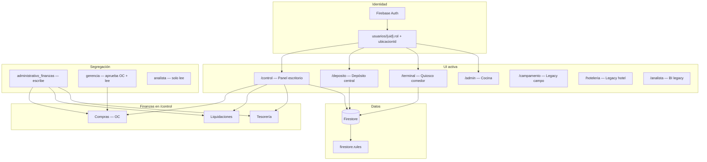
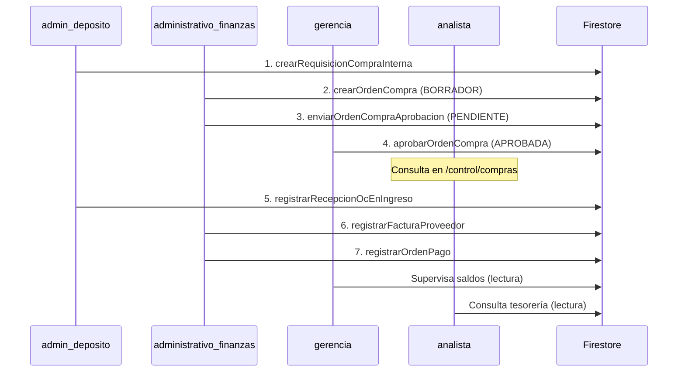
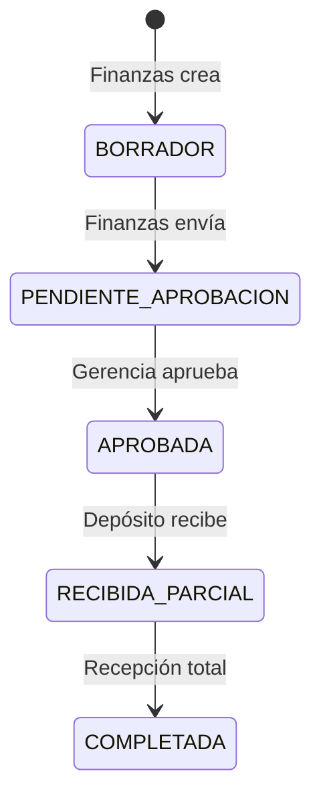
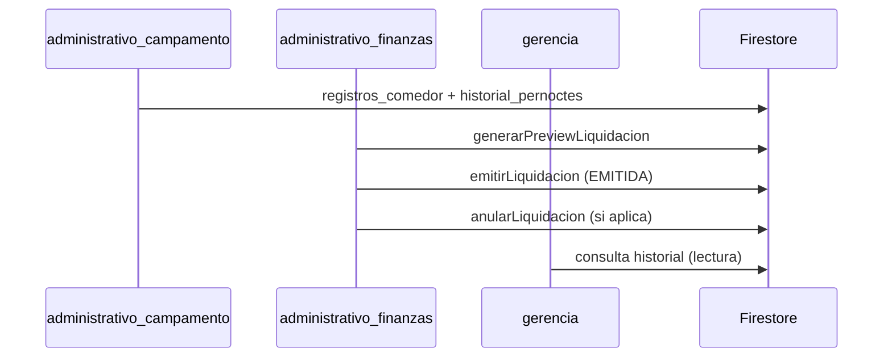
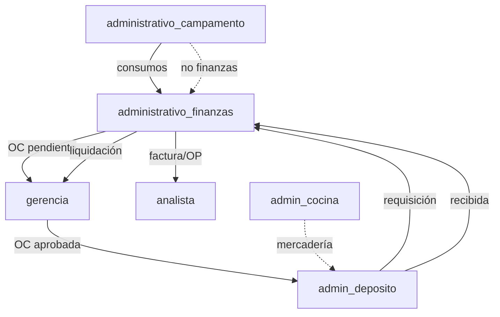

# Arquitectura de la aplicación — Roles, módulos e interacciones

Documento de referencia del sistema **Cocina Industrial**: roles, rutas activas, flujos entre áreas y estado del MVP.

**Fuentes:** `src/App.tsx`, `src/lib/rbac.ts`, `src/context/AuthContext.tsx`, `firestore.rules`, `docs/MODULO_A_COMPRAS.md`, `docs/MODULO_B_TESORERIA.md`, `docs/MODULO_C_FACTURACION.md`.

### Modelo de roles (Segregación de Funciones — SoD)

El sistema usa **6 roles** definidos en `AuthContext`. Los roles legacy (`admin_campamento`, `hoteleria_casposo`, `jefe_campamento`, `terminal_comedor`) fueron **reemplazados** y deben migrarse en `usuarios/{uid}.rol`.

| # | Rol | Ámbito principal |
|---|-----|------------------|
| 1 | `administrativo_campamento` | Operativo campamento + terminal (sin finanzas) |
| 2 | `admin_deposito` | Depósito central |
| 3 | `admin_cocina` | Cocina central |
| 4 | `administrativo_finanzas` | Oficina: OC, tesorería, liquidaciones (sin aprobar OC) |
| 5 | `gerencia` | Directivo: aprueba OC + lectura total |
| 6 | `analista` | BI: lectura total, sin escritura |

### Rutas activas en el MVP (montadas en `App.tsx`)

| Prefijo | Roles | Estado |
|---------|-------|--------|
| `/control` | `administrativo_campamento`, `administrativo_finanzas`, `gerencia`, `analista` | **Activo** |
| `/deposito` | `admin_deposito` | **Activo** |
| `/terminal` | `administrativo_campamento` | **Activo** |
| `/admin` | `admin_cocina` | **Activo** |
| `/campamento` | `administrativo_campamento` | **Activo** (legacy) |
| `/hoteleria` | `administrativo_campamento` | **Activo** (legacy) |
| `/analista` | `gerencia`, `analista` | **Activo** (BI legacy) |
| Vista pública pedidos | anónimo | Comentada (`ClientView`) |

### Iteraciones recientes

| Iter. | Entrega |
|:-----:|---------|
| 6–10 | Finanzas MVP: Tesorería, Compras, Liquidaciones backend + UI |
| 11 | Reactivación rutas legacy + carrusel login |
| **12** | **SoD: 6 roles, segregación comprador/aprobador/directivo/BI** |

---

## 1. Visión general

La aplicación cubre **comedor + hotelería de campamento**, **depósito central**, **cocina** y **finanzas** con segregación de funciones:

| Módulo | Área | Sentido del flujo |
|--------|------|-------------------|
| **A — Compras** | Cuentas por pagar (proveedores) | Depósito pide → **Finanzas** emite OC → **Gerencia** aprueba → Depósito recibe |
| **B — Tesorería** | Pagos a proveedores | Factura OC → Orden de pago |
| **C — Liquidaciones** | Cuentas por cobrar (contratistas) | Consumos operativos → Pre-factura mensual |



### Capas de autorización

| Capa | Qué controla |
|------|----------------|
| **Firebase Auth** | Identidad (email/contraseña) |
| **`usuarios/{uid}`** | Rol obligatorio; sin rol válido → logout |
| **`ProtectedRoute`** | Rutas por rol; sub-rutas operativas vs finanzas separadas en `/control` |
| **`rutaHomePorRol()` / `rolPuedeAccederRuta()`** | Post-login y deep-links |
| **`firestore.rules`** | Autorización real (SoD en backend) |
| **Sidebar / botones UI** | Oculta secciones y acciones según rol |

### Matriz SoD — Quién escribe qué

| Acción | `administrativo_campamento` | `administrativo_finanzas` | `gerencia` | `analista` |
|--------|:---------------------------:|:-------------------------:|:----------:|:----------:|
| Padrón, camas, comedor | ✅ | — | 👁 | 👁 |
| Crear / enviar OC | — | ✅ | 👁 | 👁 |
| **Aprobar OC** | — | — | ✅ | — |
| Facturas, OP, liquidaciones | — | ✅ | 👁 | 👁 |
| Terminal comedor | ✅ | — | — | — |

👁 = solo lectura en UI y reglas (salvo aprobación OC en gerencia).

---

## 2. Roles del sistema

Definidos en `src/context/AuthContext.tsx` (`UserRole`).

| Rol | Home post-login | Escritura | Lectura |
|-----|-----------------|-----------|---------|
| `administrativo_campamento` | `/control` | Operativo + terminal | — |
| `administrativo_finanzas` | `/control/compras` | Finanzas (sin aprobar OC) | Finanzas + operativo* |
| `gerencia` | `/control` | Solo aprobar OC | Todo |
| `analista` | `/control` | — | Todo |
| `admin_deposito` | `/deposito` | Depósito + requisiciones | — |
| `admin_cocina` | `/admin/pedidos` | Cocina | — |

\* Firestore permite lectura operativa a finanzas para liquidaciones y contexto de OC.

**Ubicación default (`ubicacionId`):**

| Rol | Default si no viene en documento |
|-----|----------------------------------|
| `admin_deposito` | `CENTRAL` |
| `administrativo_campamento` | `CASPOSO` |
| `admin_cocina` | `COCINA` |
| `gerencia`, `analista`, `administrativo_finanzas` | solo lo del documento |

### Migración desde roles legacy

| Rol anterior (Firestore) | Rol nuevo |
|--------------------------|-----------|
| `admin_campamento`, `hoteleria_casposo`, `jefe_campamento`, `terminal_comedor` | `administrativo_campamento` |
| Usuario que hacía compras/tesorería en gerencia | `administrativo_finanzas` |
| Directivo que solo supervisa/aprueba | `gerencia` |
| `analista` | `analista` (sin cambio) |
| `admin_deposito`, `admin_cocina` | sin cambio |

### Constantes RBAC (`src/lib/rbac.ts`)

| Constante | Roles |
|-----------|-------|
| `ROLES_CONTROL` | Los 4 roles con acceso a `/control` |
| `ROLES_PANEL_CONTROL` | `administrativo_campamento`, `gerencia`, `analista` — ven menú **Operaciones** |
| `ROLES_PANEL_CONTROL_ESCRITURA` | `administrativo_campamento` — único escritor operativo |
| `ROLES_FINANZAS_ESCRITURA` | `administrativo_finanzas` |
| `ROLES_FINANZAS_LECTURA` | `administrativo_finanzas`, `gerencia`, `analista` — ven menú **Finanzas** |
| `ROLES_TERMINAL` | `administrativo_campamento` |
| `ROLES_DEPOSITO` | `admin_deposito` |
| `ROLES_VISION_GLOBAL_LECTURA` | `analista`, `gerencia`, `administrativo_finanzas` |

**Helpers clave:** `puedeAprobarOc()`, `puedeOperarFinanzas()`, `esRolPanelControlEscritura()`, `rutaHomePorRol()`, `rolPuedeAccederRuta()`.

---

## 3. Módulos activos (rutas montadas)

### 3.1 Panel `/control` — Operaciones

**Roles ruta (`ROLES_PANEL_CONTROL`):** `administrativo_campamento`, `gerencia`, `analista`

**Escritura:** solo `administrativo_campamento`. Gerencia y analista ven pantallas en modo consulta.

| Ruta | Módulo |
|------|--------|
| `/control` | Dashboard Comensales |
| `/control/hoteleria` | Dashboard Hotelería |
| `/control/padron` | Padrón personas |
| `/control/empresas` | Padrón empresas |
| `/control/alojamiento` | Mapa de camas |
| `/control/reporte-limpieza` | Auditoría limpieza |
| `/control/facturacion` | Facturación operativa (export Excel) |
| `/control/configuracion` | Config. hotelería |

> `administrativo_finanzas` **no** accede a estas sub-rutas (bloqueado por `ProtectedRoute`).

**Menú (`ControlSidebar`):** sección **Operaciones** visible solo para `ROLES_PANEL_CONTROL`.

---

### 3.2 Panel `/control` — Finanzas (Módulos A + B + C)

**Roles ruta (`ROLES_FINANZAS_LECTURA`):** `administrativo_finanzas`, `gerencia`, `analista`

| Ruta | Módulo | `administrativo_finanzas` | `gerencia` | `analista` |
|------|--------|:-------------------------:|:----------:|:----------:|
| `/control/compras` | Bandeja comprador | Crear/enviar OC | Solo **Aprobar** OC | Lectura |
| `/control/liquidaciones` | Liquidaciones contratistas | Emitir + anular | Lectura | Lectura |
| `/control/tesoreria` | Facturas y OP | Escritura | Lectura | Lectura |

**Detalle UI:**

| Pantalla | Acciones por rol |
|----------|------------------|
| `ComprasAprobacionPage` | Finanzas: Nueva OC, Crear desde requisición, Enviar a aprobación · Gerencia: botón **Aprobar** · Analista: sin botones |
| `LiquidacionesPage` | Finanzas: wizard emitir + anular · Gerencia/Analista: historial lectura |
| `TesoreriaDashboardPage` | Finanzas: facturas, OP, anulaciones · Gerencia/Analista: consulta |

**Backend Finanzas:**

| Módulo | Funciones |
|--------|-----------|
| A — Compras | `crearOrdenCompra`, `enviarOrdenCompraAprobacion`, `aprobarOrdenCompra`, `registrarRecepcionOcEnIngreso` |
| B — Tesorería | `registrarFacturaProveedor`, `registrarOrdenPago`, `anularOrdenPago`, `anularFacturaProveedor` |
| C — Liquidaciones | `generarPreviewLiquidacion`, `emitirLiquidacion`, `anularLiquidacion` |

**Menú:** sección **Finanzas** visible para `ROLES_FINANZAS_LECTURA`. Oculta para `administrativo_campamento`.

---

### 3.3 Depósito `/deposito`

**Rol:** `admin_deposito` — sin cambios respecto al modelo anterior.

| Ruta | Función |
|------|---------|
| `/deposito/ordenes-compra` | Requisiciones + recepción OC |
| `/deposito/movimientos` | Movimientos manuales |
| `/deposito/insumos`, `/inventario`, `/trazabilidad` | Catálogo y stock |

---

### 3.4 Terminal `/terminal`

**Rol:** `administrativo_campamento`

| Función | Detalle |
|---------|---------|
| Registro QR / DNI | `TerminalComensalesPage` |
| Modo offline | Cola local + sync |
| Firestore | Solo **create** en `registros_comedor` |

---

### 3.5 Cocina `/admin`

**Rol:** `admin_cocina` — sin cambios.

| Ruta | Función |
|------|---------|
| `/admin/pedidos` | Home del rol |
| `/admin/mercaderia` | Solicitudes a depósito |
| `/admin/menu`, `/recetario`, `/dashboard` | Gestión cocina |

---

### 3.6–3.8 Rutas legacy

| Prefijo | Rol | Nota |
|---------|-----|------|
| `/campamento` | `administrativo_campamento` | Logística campo; operativa principal en `/control` |
| `/hoteleria` | `administrativo_campamento` | Silo hotelería legacy |
| `/analista` | `gerencia`, `analista` | BI; Finanzas ERP en `/control/*` |

---

## 4. Flujo inter-roles

### 4.1 Cadena Compras → Recepción → Tesorería (SoD)



| Paso | Quién | Acción |
|:----:|-------|--------|
| 1 | Depósito | Requisición interna |
| 2–3 | **Administrativo finanzas** | Crear y enviar OC |
| 4 | **Gerencia** | Aprobar OC (único rol) |
| 5 | Depósito | Recepción física |
| 6–7 | **Administrativo finanzas** | Factura y pago |
| — | Gerencia / Analista | Supervisión lectura |

**Estados OC:**



---

### 4.2 Cadena Liquidaciones (Módulo C)



---

### 4.3 Mapa de dependencias (SoD)



---

## 5. Funciones por rol — Resumen ejecutivo

### `administrativo_campamento`

| Ámbito | Detalle |
|--------|---------|
| **UI** | `/control` (operaciones), `/terminal`, legacy `/campamento`, `/hoteleria` |
| **Escritura** | Comensales, hotelería, padrón, camas, config, terminal |
| **No ve** | Menú Finanzas |
| **No puede** | OC, tesorería, liquidaciones, depósito |

### `administrativo_finanzas`

| Ámbito | Detalle |
|--------|---------|
| **UI** | `/control/compras`, `/control/tesoreria`, `/control/liquidaciones` |
| **Escritura** | Crear/enviar OC, facturas, OP, liquidaciones |
| **No puede** | Aprobar OC, operativo campamento, depósito |
| **Home** | `/control/compras` |

### `gerencia`

| Ámbito | Detalle |
|--------|---------|
| **UI** | `/control` completo (operaciones + finanzas) en **lectura** |
| **Escritura exclusiva** | Aprobar OC (`puedeAprobarOc`) |
| **Supervisión** | Ve todo; no crea facturas ni liquidaciones |

### `analista`

| Ámbito | Detalle |
|--------|---------|
| **UI** | `/control` + `/analista/*` (BI legacy) |
| **Permiso** | 100% lectura; sin botones de acción en finanzas ni operativo |

### `admin_deposito` / `admin_cocina`

Sin cambios respecto al diseño previo (depósito: requisiciones + recepción; cocina: `/admin/*`).

---

## 6. Matriz UI — Menú sidebar `/control`

| Ítem menú | adm. campamento | adm. finanzas | gerencia | analista |
|-----------|:---:|:---:|:---:|:---:|
| Operaciones (comensales, hotel, padrón) | ✅ W | — | ✅ R | ✅ R |
| Finanzas → Compras | — | ✅ W† | ✅ R‡ | ✅ R |
| Finanzas → Liquidaciones | — | ✅ W | ✅ R | ✅ R |
| Finanzas → Tesorería | — | ✅ W | ✅ R | ✅ R |
| Configuración | ✅ W | — | ✅ R | ✅ R |
| Terminal `/terminal` | ✅ | — | — | — |
| Depósito `/deposito` | — | — | — | — |
| Cocina `/admin` | — | — | — | — |

W = escritura · R = lectura · † = crear/enviar OC · ‡ = solo botón Aprobar OC

---

## 7. Matriz Firestore — Finanzas (SoD)

Leyenda: **R** lectura, **W** escritura, **A** aprobación OC, **—** sin acceso.

### 7.1 Compras y tesorería

| Colección | admin_deposito | adm. finanzas | gerencia | analista | adm. campamento |
|-----------|:---:|:---:|:---:|:---:|:---:|
| `ordenes_compra` | R + W‡ | R/W (borrador/envío) | R + **A** | R | — |
| `solicitudes_mercaderia` | R/W req. | R + W† | R | R | — |
| `facturas_proveedores` | — | R/W | R | R | — |
| `ordenes_pago` | — | R/W | R | R | — |
| `contadores/numeracion_oc` | R | R/W | R | — | — |
| `padron_empresas` | R/W | R/W | R | R | R/W operativo |

- ‡ Depósito: update solo recepción (`depositoActualizaOcRecepcion`).
- † Finanzas vincula requisición al crear OC (`compradorVinculaRequisicionOc`).
- **A** Gerencia: `gerenciaApruebaOrdenCompra` (PENDIENTE → APROBADA).

### 7.2 Liquidaciones

| Colección / campo | adm. finanzas | gerencia | analista |
|-------------------|:---:|:---:|:---:|
| `liquidaciones_contratistas` | R/W | R | R |
| `registros_comedor.liquidado` | W (batch) | — | — |
| `historial_pernoctes.liquidado` | W (batch) | — | — |

Funciones reglas: `isComprador()` = `administrativo_finanzas`; `finanzasEscritura()` / `finanzasLectura()`; `panelControlEscritura()` = solo `administrativo_campamento`.

---

## 8. Colecciones Firestore — ERP extendido

*(Sin cambios de nombre respecto a iteraciones anteriores.)*

| Colección | Propósito |
|-----------|-----------|
| `ordenes_compra` | OC con estados y segregación comprador/aprobador |
| `solicitudes_mercaderia` | Requisiciones depósito → finanzas |
| `facturas_proveedores`, `ordenes_pago` | Tesorería (Módulo B) |
| `liquidaciones_contratistas` | Pre-facturas contratistas (Módulo C) |
| `padron_empresas` | Dual PROVEEDOR / CONTRATISTA + `saldoCuentaCorriente` |

---

## 9. Autenticación

| Rol | `rutaHomePorRol()` |
|-----|---------------------|
| `administrativo_campamento`, `gerencia`, `analista` | `/control` |
| `administrativo_finanzas` | `/control/compras` |
| `admin_deposito` | `/deposito` |
| `admin_cocina` | `/admin/pedidos` |

**Login:** `rolPuedeAccederRuta()` valida deep-links. Roles legacy en Firestore → logout (rol no reconocido).

**Despliegue reglas SoD:**
```bash
firebase deploy --only firestore:rules
```

---

## 10. Brechas y pendientes

### 10.1 Compras

| Ítem | Estado |
|------|--------|
| SoD comprador vs aprobador | ✅ Hecho (Iter. 12) |
| Editar borrador OC | ❌ Falta |
| Rechazar / cancelar OC | ❌ Falta |
| ABM proveedor en UI | ❌ Falta |

### 10.2 Roles

| Ítem | Estado |
|------|--------|
| Migración `usuarios/{uid}.rol` en Firestore | ⚠️ Manual |
| Menú operativo oculto para finanzas | ✅ Hecho |
| Menú finanzas oculto para campamento | ✅ Hecho |
| Gerencia solo lectura en operativo (UI) | ✅ Hecho (reglas + UI) |

### 10.3 Checklist E2E (SoD)

**Compras:**
1. [ ] Depósito: requisición
2. [ ] **Administrativo finanzas:** crear OC → enviar
3. [ ] **Gerencia:** aprobar (sin poder crear OC)
4. [ ] Depósito: recepcionar
5. [ ] **Administrativo finanzas:** factura + OP
6. [ ] **Analista:** ver saldos sin modificar

---

## 11. Módulos legacy

| Prefijo | Rol actual |
|---------|------------|
| `/campamento`, `/hoteleria` | `administrativo_campamento` |
| `/analista` | `gerencia`, `analista` |

---

## 12. Discrepancias conocidas

1. **Dos ingresos depósito:** manual vs recepción OC — solo el segundo alimenta finanzas.
2. **Padrón dual:** proveedores y contratistas comparten `saldoCuentaCorriente` con significado distinto.
3. **Dos UIs liquidaciones:** `/control/liquidaciones` (ERP) vs `/analista/liquidaciones` (Excel legacy).
4. **Batch billing eventual:** fallo post-emisión requiere reconciliación manual.
5. **Migración pendiente:** usuarios con roles legacy no pueden iniciar sesión hasta actualizar Firestore.

---

## 13. Archivos de referencia

| Concepto | Archivo |
|----------|---------|
| Roles (6) | `src/context/AuthContext.tsx` |
| RBAC SoD | `src/lib/rbac.ts` |
| Rutas + ProtectedRoute | `src/App.tsx` |
| Sidebar segregado | `src/components/layouts/ControlSidebar.tsx` |
| Compras UI SoD | `src/views/control/ComprasAprobacionPage.tsx` |
| Reglas Firestore SoD | `firestore.rules` |

---

*Última actualización: mayo 2026 — Iter. 12: Segregación de Funciones con 6 roles. Comprador (`administrativo_finanzas`) separado de aprobador (`gerencia`). Operativo unificado en `administrativo_campamento`.*
