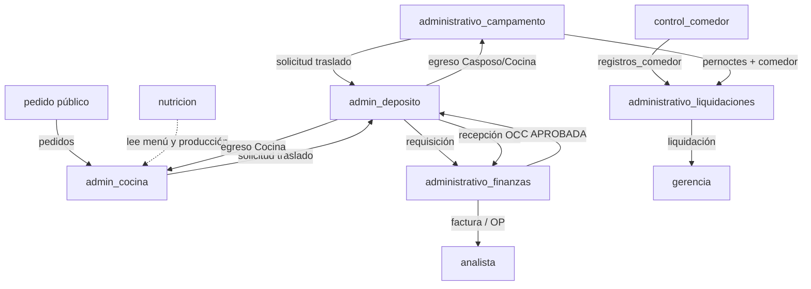

# Arquitectura de la aplicación — Roles, módulos y alcances

Documento de referencia del sistema **Cocina Industrial**: identidad, **9 roles**, rutas montadas, funciones por módulo, flujos entre áreas y brechas conocidas.

**Fuentes de verdad:** `src/App.tsx`, `src/lib/rbac.ts`, `src/context/AuthContext.tsx`, `src/components/layouts/ControlSidebar.tsx`, `firestore.rules`.

**Corte:** 1 sep 2026.

---

## 1. Qué es el sistema

App web (React + Firebase Auth + Firestore) para un **comedor industrial** con:

- Quiosco de comedor (registros de acceso)
- Hotelería de campamento (camas, padrón, pernoctes, limpieza)
- Logística de campamento (stock Casposo, solicitudes, comandas)
- Depósito central (insumos, lotes, traslados, requisiciones a compras)
- Cocina central (menú, producción, pedidos de viandas, despacho, mercadería)
- Nutrición (recetario técnico y costos)
- Finanzas (compras/OC, proveedores, tesorería)
- Liquidaciones a contratistas (cuentas por cobrar)
- Analista / gerencia (reportes estructurados, no laboratorio SQL)

No hay ABM de usuarios en la UI: el rol vive en `usuarios/{uid}.rol` (Firestore), cargado a mano.

---

## 2. Capas de autorización

| Capa | Qué controla |
|------|----------------|
| **Firebase Auth** | Identidad email/contraseña. Pedidos públicos: sesión **anónima**. |
| **`usuarios/{uid}`** | `rol` obligatorio + `ubicacionId` opcional. Sin rol válido → logout. |
| **`ProtectedRoute`** | Sin sesión → `/login`. Rol no permitido → pantalla “Acceso denegado” (no redirige al home del rol). |
| **`rutaHomePorRol()` / `rolPuedeAccederRuta()`** | Destino post-login y deep-links. |
| **`firestore.rules`** | Autorización real (SoD). La UI puede mostrar botones que Firestore rechaza. |
| **Sidebars** | Ocultan secciones según rol. |

**Ubicación default si el documento no trae `ubicacionId`:**

| Rol | Default |
|-----|---------|
| `administrativo_campamento`, `control_comedor` | `CASPOSO` |
| `admin_cocina`, `nutricion` | `COCINA` |
| `admin_deposito` | `CENTRAL` |
| Resto | solo lo del documento (puede ser `null`) |

**Ubicaciones de stock:** `CENTRAL` (depósito), `COCINA`, `CASPOSO`.

---

## 3. Los 9 roles (de menor a mayor alcance)

Definidos en `AuthContext` (`UserRole`). Orden: silo más chico → visión más amplia.

| # | Rol | Home | Alcance en una frase |
|---|-----|------|----------------------|
| 1 | `control_comedor` | `/terminal` | Solo quiosco: registrar comidas. |
| 2 | `nutricion` | `/nutricion` | Recetario, costos teóricos, desvío ficha vs cocina. No mueve stock ni pedidos. |
| 3 | `admin_cocina` | `/admin/pedidos` | Menú, producción, pedidos, despacho, pedir mercadería al depósito. |
| 4 | `admin_deposito` | `/deposito` | Catálogo, stock central, movimientos, requisiciones a compras, recepción OC. |
| 5 | `administrativo_campamento` | `/campamento/recepcion` | Stock Casposo + hotelería (`/hoteleria`). **No entra a `/control`.** |
| 6 | `administrativo_liquidaciones` | `/control/liquidaciones` | Solo emitir/anular liquidaciones a contratistas. |
| 7 | `administrativo_finanzas` | `/control/compras` | OC, proveedores, tesorería. No aprueba OC en UI (ver §12). No opera campamento. |
| 8 | `analista` | `/control` | Lectura: operaciones `/control`, finanzas, liquidaciones, `/campamento`, `/analista`. Sin escritura. |
| 9 | `gerencia` | `/control` | Igual que analista en lectura + helper `puedeAprobarOc` (reglas Firestore; **la UI de compras hoy no cablea el botón**). |

Roles legacy (`admin_campamento`, `hoteleria_casposo`, `jefe_campamento`, `terminal_comedor`) **no se parsean**: login rechazado hasta migrar `usuarios/{uid}.rol`.

---

## 4. Constantes RBAC (`src/lib/rbac.ts`)

| Constante | Roles | Efecto |
|-----------|-------|--------|
| `ROLES_TERMINAL` | `control_comedor` | `/terminal` |
| `ROLES_NUTRICION` | `nutricion` | `/nutricion` |
| `ROLES_DEPOSITO` | `admin_deposito` | `/deposito` |
| `ROLES_LOGISTICA_CAMPAMENTO_ESCRITURA` | `administrativo_campamento` | Opera `/campamento` y `/hoteleria` |
| `ROLES_LOGISTICA_CAMPAMENTO_LECTURA` | campamento, gerencia, analista | Entran a `/campamento` |
| `ROLES_CONTROL` | finanzas, liquidaciones, gerencia, analista | Layout `/control` (campamento **ya no**) |
| `ROLES_PANEL_CONTROL` | gerencia, analista | Subrutas operativas de `/control` (comensales, padrón, camas, facturación sábana) |
| `ROLES_PANEL_CONTROL_ESCRITURA` | `administrativo_campamento` | Escritura Firestore de padrón/camas (vía `/hoteleria`, no `/control`) |
| `ROLES_FINANZAS_ESCRITURA` | `administrativo_finanzas` | Crear OC, facturas, OP |
| `ROLES_FINANZAS_LECTURA` | finanzas, gerencia, analista | `/control/compras`, proveedores, tesorería |
| `ROLES_LIQUIDACIONES_ESCRITURA` | `administrativo_liquidaciones` | Emitir/anular liquidaciones |
| `ROLES_LIQUIDACIONES_LECTURA` | liquidaciones, gerencia, analista | `/control/liquidaciones` |
| `ROLES_VISION_GLOBAL_LECTURA` | analista, gerencia, finanzas, liquidaciones | Lectura transversal sin silo de ubicación |

**Helpers:** `rutaHomePorRol()`, `rolPuedeAccederRuta()`, `puedeOperarFinanzas()`, `puedeOperarLiquidaciones()`, `puedeAprobarOc()` (solo `gerencia`; **no usado en vistas**).

---

## 5. Mapa de rutas

### 5.1 Públicas

| Ruta | Quién | Qué hace | Qué no |
|------|-------|----------|--------|
| `/` | — | Redirige a `/login` | Landing |
| `/login` | Público | Email/password → home del rol | Registro, recuperar clave, SSO, ABM usuarios |
| `/pedido` | Anónimo | Pedido semanal genérico (7 días, stock, lugar de entrega) | Editar pedido ya enviado |
| `/pedido/:token` | Anónimo (link empresa) | Pedido atado a planificación publicada | Editar después del envío |
| `*` | — | Redirige a `/login` | — |

Usuario interno logueado que abre `/pedido` es redirigido a su home.

### 5.2 Prefijos por rol

| Prefijo | Roles | Estado |
|---------|-------|--------|
| `/terminal` | `control_comedor` | Activo (quiosco fullscreen) |
| `/nutricion` | `nutricion` | Activo |
| `/admin` | `admin_cocina` | Activo |
| `/deposito` | `admin_deposito` | Activo |
| `/campamento` | campamento (escribe), gerencia/analista (leen) | Activo — **solo logística/stock** |
| `/hoteleria` | `administrativo_campamento` | Activo — mapa, padrón, pernoctes, limpieza, config |
| `/control` | finanzas, liquidaciones, gerencia, analista (subrutas filtradas) | Activo |
| `/analista` | `gerencia`, `analista` | Activo — 4 reportes estructurados |

**Aliases / redirecciones (no hay pantalla propia):** `/comedor` → `/terminal`; `/admin-cocina` → `/admin/pedidos`; `/admin/dashboard` y `/admin/recetario` → pedidos; `/deposito/solicitudes` y `/deposito/recepcion` → movimientos; `/campamento/comensales` → recepción; `/analista/costos` y `/resumen-mensual` → dashboard; `/analista/logistica` → movimientos; `/analista/produccion` → auditoría; `/control/menu` → `/control`.

---

## 6. Funciones por rol (detalle)

### 6.1 `control_comedor` — alcance mínimo

| | |
|--|--|
| **UI** | Solo `/terminal` (sin sidebar) |
| **Hace** | Elegir servicio (desayuno, almuerzo+refrigerio, merienda, cena, cena nocturna, viandas). Registrar por QR o DNI/nombre sobre padrón (caché offline). Anti-duplicado día/servicio. Cola offline. Historial del dispositivo. Logout. |
| **No hace** | Editar/borrar registros. Ver dashboards. Entrar a hotelería, depósito, cocina. |
| **Firestore** | Create en `registros_comedor`. Lectura de `padron_personas`. |

### 6.2 `nutricion`

| Ruta | Función | Alcance |
|------|---------|---------|
| `/nutricion` | Dashboard KPIs recetas/costos | Consulta |
| `/nutricion/recetario` | CRUD fichas técnicas (ingredientes, mermas, costos, dietas, procedimiento, PDF) | Escritura recetas |
| `/nutricion/ingenieria-menu` | Rankings de pedidos históricos | Solo lectura analítica |
| `/nutricion/planificacion` | Cruza menú × recetas → costo teórico vianda, PDF | No edita menú ni publica empresas |
| `/nutricion/produccion-real` | Ficha teórica vs producción cocina (alerta desvío >5%) | No corrige producción |

No opera stock, OC, comensales ni pedidos de clientes.

### 6.3 `admin_cocina`

| Ruta | Función |
|------|---------|
| `/admin/pedidos` | Pedidos del día: filtros, cantidades, Excel, archivar turno, saltar a despacho |
| `/admin/menu` | Ítems de menú (nombre, stock, vencimiento) + tab **producción** (lotes, QR, descuenta insumos, suma stock menú) |
| `/admin/planificacion` | Menú semanal por empresa, publicar token `/pedido/:token`, PDF, alta empresa cliente |
| `/admin/despacho` | Armar remito viandas (pedidos o manual), FIFO lotes, PDF |
| `/admin/trazabilidad` | Timeline lote/QR: ingreso → traslado → recepción → producción → despacho |
| `/admin/mercaderia` | Tabs: solicitar al depósito, remitos a recibir, stock local (heladera). Requiere `ubicacionId` |
| `/admin/mercaderia/solicitud/:id` | Detalle solicitud, solo lectura |

**Recetario no está en cocina:** `/admin/recetario` redirige a pedidos. Vive en nutrición.

### 6.4 `admin_deposito`

| Ruta | Función |
|------|---------|
| `/deposito/dashboard` | Capital inmovilizado, lotes por vencer (15 días), insumos sin rotación (>30 días) |
| `/deposito/insumos` | CRUD catálogo: nombre, marca, rubro, unidad base (Kg/Lt/Un), empaques con **factor**, costos |
| `/deposito/configuracion` | CRUD rubros/subrubros |
| `/deposito/movimientos` | Historial; crear ingreso/egreso/ajuste/decomiso; aprobar solicitudes; PDF remito; Excel de **cabeceras** (no kilos por insumo) |
| `/deposito/ingreso` | Ingreso contra OC o libre (lotes, vencimiento, comprobante). **No está en el sidebar** (se entra desde Movimientos) |
| `/deposito/ordenes-compra` | Requisición interna a finanzas. No emite la OC ni recepciona acá |
| `/deposito/inventario` | Stock actual por insumo/lote en CENTRAL, filtros, Excel |
| `/deposito/trazabilidad` | Timeline de un lote (red multi-ubicación) |

**Modelo de insumos:** el stock **siempre** se guarda en unidad base. Las “presentaciones de empaque” (caja 15 kg, factor 15) solo convierten al cargar en **Movimientos**. Inventario no cuenta “cajas cerradas vs abiertas”. Solicitudes de cocina/campamento piden en Kg/Lt/Un, no con el conversor.

**Reportes del depósito:** operativos (qué hay ahora, qué vence). No hay “ingresos de carnes esta semana” ni “enviado a Casposo por insumo” como pantalla (eso es dato + Excel en analista).

### 6.5 `administrativo_campamento`

Dos silos. **Ya no hay toggle Comensales/Stock ni acceso a `/control`.**

**Logística (`/campamento`) — menú actual:**

| Ruta | Función |
|------|---------|
| `/campamento/recepcion` | Recibir traslados del depósito (remito). Home del rol |
| `/campamento/solicitud-mercaderia` | Pedir insumos al depósito |
| `/campamento/solicitud-mercaderia/:id` | Detalle, solo lectura |
| `/campamento/inventario` | Stock local Casposo |
| `/campamento/comandas` | Historial de consumo diario |
| `/campamento/comandas/nueva` | Egreso FIFO del stock local |

**Hotelería (`/hoteleria`) — no aparece en el sidebar de stock; se entra por URL `/hoteleria`:**

| Ruta | Función |
|------|---------|
| `/hoteleria/mapa` | Check-in/out, traslados, limpieza, mantenimiento, masivos |
| `/hoteleria/padron` | CRUD personas, Excel, credencial QR |
| `/hoteleria/pernoctes` | Reporte noches (consulta; ajustes están en `/control/hoteleria`, que este rol **no ve**) |
| `/hoteleria/reporte-limpieza` | Consulta + Excel |
| `/hoteleria/configuracion` | Alta/baja de camas |

**No ve:** dashboard comensales, sábana facturación, padrón empresas, dashboard hotelería, compras, tesorería, liquidaciones, depósito, cocina.

**Escritura Firestore de padrón/camas:** sigue siendo este rol (`panelControlEscritura`).

### 6.6 `administrativo_liquidaciones`

| | |
|--|--|
| **UI** | Solo `/control/liquidaciones` |
| **Hace** | Wizard: preview comedor + pernoctes, precios, IVA, emitir, anular. Historial. |
| **No hace** | Compras, tesorería, padrón, camas, depósito. |

### 6.7 `administrativo_finanzas`

| Ruta | Función |
|------|---------|
| `/control/compras` | Requisiciones, OC, pendientes de facturar. **Crear OC** (hoy sale **APROBADA** directo). Facturar desde OC |
| `/control/compras/:id` | Expediente OC (3 vías), PDF, adjuntos |
| `/control/proveedores` | ABM proveedores (empresas con rol proveedor) |
| `/control/proveedores/:id` | Legajo: OC, facturas, OP, documentos, lista de precios, PDF |
| `/control/tesoreria` | CxP, vencimientos, facturas, órdenes de pago, adjuntos, anulaciones |

**No hace:** aprobar OC (flujo de gerencia no está en UI), liquidaciones, operativo campamento, depósito.

### 6.8 `analista`

Lectura. Dos puertas:

1. **`/control`** — mismas pantallas operativas y de finanzas/liquidaciones que gerencia, **sin escritura** (Firestore). En hotelería/padrón de `/control` la UI **aún muestra botones de escritura**; fallan en reglas.
2. **`/analista`** — cuatro reportes **estructurados** (filtros fijos + Excel). No es SQL ni constructor de reportes.

| Ruta | Pregunta que responde |
|------|------------------------|
| `/analista/dashboard` | Capital inmovilizado, costo alimentación, decomiso, gráfico egresos vs asistencias |
| `/analista/liquidaciones` | Comidas + noches por empresa (consulta, no emite) |
| `/analista/auditoria` | Día a día Casposo (movimientos vs comedor) o cocina (producciones) |
| `/analista/movimientos` | Líneas de movimiento: insumo, kg/lt/un, rubro, destino. Lo más “libre”; totales en Excel |

También puede entrar a `/campamento` (consulta).

### 6.9 `gerencia`

Igual que analista en lectura ( `/control` + `/analista` + `/campamento` ).

En reglas: único que puede transicionar OC `PENDIENTE_APROBACION` → `APROBADA`. **En la UI actual las OC nuevas se emiten APROBADAS por finanzas**; `puedeAprobarOc` no se usa en vistas.

---

## 7. Panel `/control` — quién ve qué

`ControlSidebar` arma el menú según rol (sin toggle).

| Sección | Ítems | Quién la ve |
|---------|-------|-------------|
| Comensales y hotelería | Dashboard comensales, dashboard hotelería, padrón, empresas, mapa, limpieza, facturación sábana, config camas | `gerencia`, `analista` |
| Stock y pedidos | Recepción, solicitud, inventario Casposo, comandas | `administrativo_campamento` (en layout campamento) |
| Compras y pagos | OC, proveedores, tesorería | finanzas, gerencia, analista |
| Liquidaciones | Liquidaciones | liquidaciones, gerencia, analista |

**Facturación `/control/facturacion`:** sábana Excel comedor + pernoctes por DNI. **No emite comprobantes fiscales.**

**Solape Control vs Hotelería** (mismo componente, dos URLs):

| Pantalla | `/control` (gerencia/analista) | `/hoteleria` (campamento) |
|----------|:-----------------------------:|:-------------------------:|
| Mapa de camas | `/control/alojamiento` | `/hoteleria/mapa` |
| Padrón personas | `/control/padron` | `/hoteleria/padron` |
| Limpieza | sí | sí |
| Config camas | sí | sí |
| Dashboard hotelería | sí | no |
| Padrón empresas | sí | no |
| Dashboard comensales | sí | no |
| Reporte pernoctes | no | sí |

---

## 8. Flujos entre roles

```mermaid
flowchart TB
  TERM[control_comedor]
  CAMP[administrativo_campamento]
  DEP[admin_deposito]
  COC[admin_cocina]
  NUT[nutricion]
  FIN[administrativo_finanzas]
  LIQ[administrativo_liquidaciones]
  GER[gerencia]
  ANA[analista]
  PUB[pedido público]

  TERM -->|registros_comedor| LIQ
  CAMP -->|pernoctes + comedor| LIQ
  CAMP -->|solicitud traslado| DEP
  COC -->|solicitud traslado| DEP
  DEP -->|requisición| FIN
  FIN -->|OC APROBADA| DEP
  DEP -->|recepción OC| FIN
  FIN -->|factura / OP| ANA
  LIQ -->|liquidación| GER
  PUB -->|pedidos| COC
  NUT -.->|lee menú y producción| COC
  DEP -->|egreso Casposo/Cocina| CAMP
  DEP -->|egreso Cocina| COC
```

### 8.1 Mercadería depósito → cocina / campamento

1. Cocina o campamento crea `solicitudes_mercaderia`.
2. Depósito arma **egreso** (lote FIFO) con destino Cocina Central o Campamento Casposo.
3. Destino **recibe** el remito (`RecepcionTrasladoContenido`).
4. Campamento consume con **comandas**; cocina consume en **producción**.

### 8.2 Compras → recepción → tesorería

1. Depósito: requisición interna.
2. Finanzas: crea OC (**hoy estado APROBADA al emitir**).
3. Depósito: ingreso contra OC (`/deposito/ingreso`) → `registrarRecepcionOcEnIngreso`.
4. Finanzas: factura proveedor + orden de pago.

Estados OC en código: `BORRADOR` → `PENDIENTE_APROBACION` → `APROBADA` → `RECIBIDA_PARCIAL` / `COMPLETADA`. El paso gerencia está en **reglas y funciones**, no en el flujo UI cotidiano.

### 8.3 Liquidaciones

Campamento/terminal generan `registros_comedor` e `historial_pernoctes`. Rol liquidaciones arma preview, emite, marca `liquidado`. Gerencia/analista consultan.

### 8.4 Viandas empresas

Cocina publica planificación → token. Empleado abre `/pedido/:token`. Cocina ve pedidos, produce, despacha remito.

---

## 9. Colecciones Firestore

| Colección | Propósito |
|-----------|-----------|
| `usuarios` | `rol`, `ubicacionId` (doc id = UID) |
| `menu`, `pedidos`, `planificacion_menu_empresa` | Menú y pedidos (público + cocina) |
| `recetario` | Fichas nutrición |
| `insumos`, `categorias` | Catálogo depósito |
| `solicitudes_mercaderia` | Pedidos a depósito **y** requisiciones a compras |
| `movimientos_inventario` | Ingresos, egresos, ajustes, decomisos (cantidad en unidad base) |
| `saldo_lotes` | Stock atómico por ubicación/insumo/lote |
| `produccion_cocina` | Corridas de producción |
| `despachos_viandas` | Remitos de viandas |
| `padron_personas`, `padron_empresas` | Personas y empresas (proveedor / contratista / cliente) |
| `registros_comedor` | Accesos al comedor |
| `camas`, `historial_limpiezas`, `historial_pernoctes` | Hotelería |
| `ordenes_compra`, `facturas_proveedores`, `ordenes_pago` | Módulos A/B |
| `documentos_adjuntos` | Expediente digital |
| `liquidaciones_contratistas` | Módulo C |
| `contadores` | Numeración OC / OP / liquidaciones |

---

## 10. Matriz SoD resumida

| Acción | Terminal | Nutrición | Cocina | Depósito | Campamento | Liquidaciones | Finanzas | Analista | Gerencia |
|--------|:---:|:---:|:---:|:---:|:---:|:---:|:---:|:---:|:---:|
| Registrar comedor (quiosco) | W | — | — | — | — | — | — | — | — |
| Recetario | — | W | — | — | — | — | — | — | — |
| Menú / producción / despacho / pedidos | — | R* | W | — | — | — | — | — | — |
| Catálogo y stock CENTRAL | — | — | — | W | — | — | — | R† | R† |
| Stock Casposo / comandas / recepción | — | — | — | — | W | — | — | R | R |
| Padrón / camas / limpieza | — | — | — | — | W | — | — | R‡ | R‡ |
| Crear OC / factura / OP | — | — | — | req. | — | — | W | R | R |
| Aprobar OC (reglas) | — | — | — | — | — | — | — | — | A |
| Emitir liquidación | — | — | — | — | — | W | — | R | R |
| Reportes `/analista` | — | — | — | — | — | — | — | R | R |

\* Nutrición lee menú/producción para costos; no opera cocina.  
† Vía `/analista/movimientos` y dashboard, no el panel depósito.  
‡ En `/control`; escritura bloqueada en Firestore. UI de padrón/camas no siempre oculta botones.

---

## 11. Alcance analítico (qué se puede saber)

Los datos de “¿cuánta carne ingresó esta semana?” o “¿cuánto se mandó a Casposo en kg por insumo?” **existen** en `movimientos_inventario`.

- **Depósito:** no hay ese reporte; Excel de movimientos es por remito, no por insumo.
- **Analista → Historial y logística:** filtros fecha / rubro / destino / tipo → Excel de **líneas**. El total se hace en pivot. No hay constructor SQL ni cruce libre (comedor × recetas × OC).

El rol analista es **módulos con rieles**, no laboratorio. Un BI/SQL real exigiría warehouse (p. ej. Firestore → BigQuery), no mutar estas pantallas.

---

## 12. Brechas y discrepancias conocidas

1. **`puedeAprobarOc` no se usa en UI.** Finanzas emite OC ya APROBADA. Las reglas siguen contemplando aprobación de gerencia.
2. **Facturación `/control/facturacion`** es sábana operativa, no AFIP.
3. **Campamento fuera de `/control`.** Perdió dashboard comensales, empresas, facturación sábana y dashboard hotelería. `/hoteleria` existe pero **no hay enlace** en el menú de stock.
4. **Ajustes de pernocte** viven en `/control/hoteleria`; campamento no entra ahí.
5. **Gerencia/analista en padrón/camas `/control`:** UI de escritura visible; Firestore niega.
6. **Dos UIs de liquidación:** `/control/liquidaciones` (emite) vs `/analista/liquidaciones` (Excel consulta).
7. **Ingreso depósito vs OC:** ingreso libre no alimenta match 3 vías; sí el ingreso contra OC.
8. **Stock en kilos, no en cajas.** Abrir una caja y mandar 5 kg es un egreso de 5 kg; no hay “cajas cerradas + sueltos”.
9. **Un solo campamento** en destinos (`CASPOSO`).
10. **Sin ABM de usuarios, recuperar contraseña ni SSO.**
11. **Sin stock mínimo / punto de pedido** ni foto histórica de inventario.
12. **Analista no es ciencia de datos:** no SQL, no joins ad hoc.

---

## 13. Archivos de referencia

| Concepto | Archivo |
|----------|---------|
| Roles (9) | `src/context/AuthContext.tsx` |
| RBAC | `src/lib/rbac.ts` |
| Router | `src/App.tsx` |
| Sidebar control / campamento | `src/components/layouts/ControlSidebar.tsx` |
| Sidebars depósito, cocina, nutrición, analista, hotelería | `src/components/*/…Sidebar.tsx` |
| Presentaciones de empaque | `src/lib/presentacionesInsumo.ts`, `src/types/insumo.ts` |
| Reglas | `firestore.rules` |
| Compras / tesorería / liquidaciones (detalle de dominio) | `docs/MODULO_A_COMPRAS.md`, `docs/MODULO_B_TESORERIA.md`, `docs/MODULO_C_FACTURACION.md` |

---

*Última actualización: 1 sep 2026 — 9 roles. Campamento: solo stock en `/campamento` + hotelería en `/hoteleria` (sin `/control`). Terminal = `control_comedor`. Liquidaciones separadas de finanzas. Nutrición con recetario. Pedidos públicos activos. Analista = reportes estructurados.*
