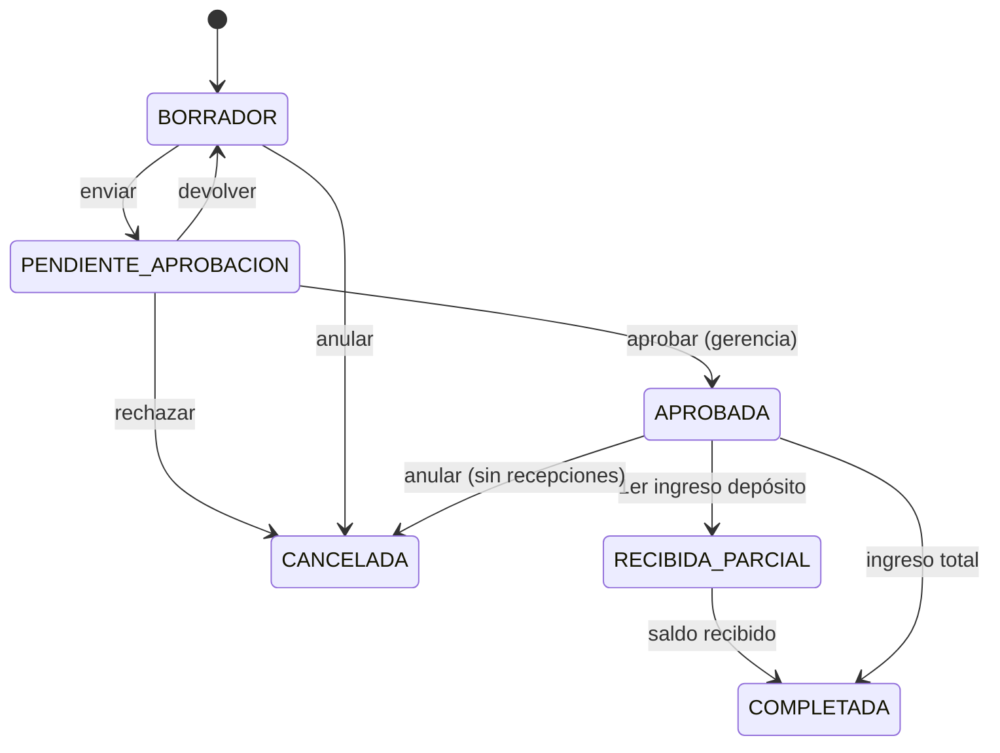
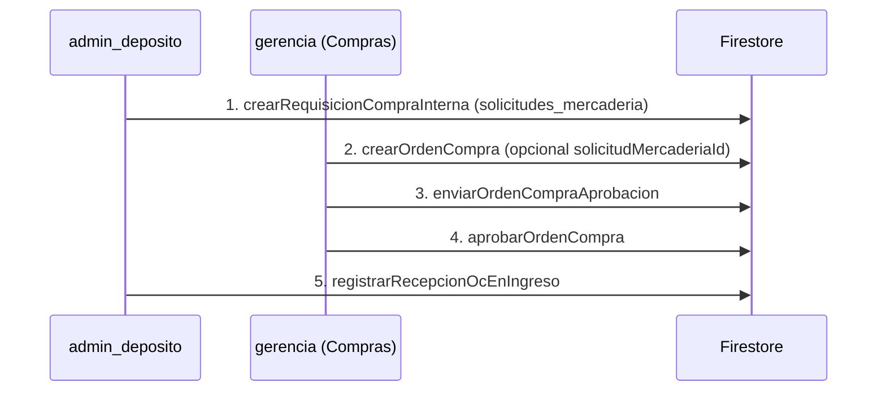

# Módulo A — Compras y Proveedores

Documento de diseño de datos (Iteración 1) e integración transaccional con Depósito (Iteración 2).

**Fuentes:** `src/types/compras.ts`, `src/lib/ordenesCompra.ts`, `firestore.rules` (pendiente despliegue).

---

## 1. Decisiones de arquitectura

| Decisión | Elección | Motivo |
|----------|----------|--------|
| Maestro proveedor | Extender `padron_empresas` | Una empresa puede ser contratista y proveedor; evita duplicar CUIT |
| Ítems de OC | **Array embebido** en `ordenes_compra` | Coherente con `solicitudes_mercaderia` y `movimientos_inventario`; OCs típicas < 50 líneas |
| Recepciones | Vínculo desde `movimientos_inventario` | El depósito crea INGRESO en transacción; la OC se actualiza en la misma TX |
| Numeración OC | Contador transaccional en `contadores/numeracion_oc` | Evita duplicados sin Cloud Functions |
| Auditoría de estados | Array `historialEstados` embebido | Trazabilidad sin colección extra en MVP |



---

## 2. Esquema NoSQL — nuevas colecciones

### 2.1 `contadores/numeracion_oc` (documento singleton)

```typescript
export interface ContadorNumeracionOc {
  anio: number
  ultimoSecuencial: number
  actualizadoEn: FirebaseFirestore.Timestamp
}
```

### 2.2 `ordenes_compra/{ocId}`

Ver tipos completos en `src/types/compras.ts`.

**Índices compuestos recomendados:**

| Colección | Campos | Uso |
|-----------|--------|-----|
| `ordenes_compra` | `estado` ASC, `fechaEmision` DESC | Bandeja depósito (OC aprobadas) |
| `ordenes_compra` | `proveedorId` ASC, `fechaEmision` DESC | Historial por proveedor |
| `ordenes_compra` | `ubicacionDestinoId` ASC, `estado` ASC | Recepciones por sucursal |

### 2.3 Extensión en `movimientos_inventario` (INGRESO)

```typescript
export interface VinculoOrdenCompraIngreso {
  ordenCompraId: string
  ordenCompraNumero: string
  recepcionLineas: {
    lineaId: string
    insumoId: string
    cantidadRecibida: number
  }[]
}
```

---

## 3. Adaptación de `padron_empresas`

Ver `src/types/compras.ts` → tipos `PadronEmpresaExtendido`, `RolEmpresaPadron`, `CondicionIva`, etc.

**Migración legacy:**

| Campo legacy | Comportamiento |
|--------------|----------------|
| Sin `roles` | Inferir `['CONTRATISTA']` en lectura |
| Sin `proveedorActivo` | `false` si no tiene rol PROVEEDOR |
| `cuit` vacío | Bloquear alta como proveedor |

---

## 4. Lógica transaccional — aprobar OC

Implementada en `aprobarOrdenCompra()` → `src/lib/ordenesCompra.ts`.

Transición: `PENDIENTE_APROBACION` → `APROBADA`.

---

## 5. Reglas de seguridad (`firestore.rules`)

Desplegadas con `firebase deploy --only firestore:rules`.

- **`isComprador()`** → hoy equivale a `isGerencia()` (extensible a rol dedicado).
- **`ordenes_compra`:** `create` solo comprador; depósito solo lectura + `depositoActualizaOcRecepcion`.
- **`solicitudes_mercaderia`:** depósito crea requisiciones `REQUISICION_COMPRA`; comprador vincula al emitir OC.

---

## 6. Matriz de permisos — Módulo A (Iteración 8)

| Acción | `admin_deposito` | `gerencia` | `analista` |
|--------|:---:|:---:|:---:|
| ABM proveedor en `padron_empresas` | ✅ | ✅ | ❌ |
| Crear requisición interna (`solicitudes_mercaderia`) | ✅ | ❌ | ❌ |
| Crear OC (borrador) | ❌ | ✅ | ❌ |
| Enviar OC a aprobación | ❌ | ✅ | ❌ |
| Aprobar / rechazar OC | ❌ | ✅ | ❌ |
| Leer OC | ✅ | ✅ | ✅ |
| Recibir mercadería (INGRESO + cruce OC) | ✅ | ❌ | ❌ |

### Flujo corporativo corregido



| Paso | Quién | Colección / función |
|:----:|-------|---------------------|
| 1 | Depósito (o futuro Cocina) | `solicitudes_mercaderia` → `crearRequisicionCompraInterna()` |
| 2 | Gerencia | `ordenes_compra` → `crearOrdenCompra({ solicitudMercaderiaId? })` |
| 3–4 | Gerencia | `enviarOrdenCompraAprobacion` / `aprobarOrdenCompra` |
| 5 | Depósito | `registrarRecepcionOcEnIngreso` |
---

## 7. Iteración 2 — Recepción cruzada con Depósito

### Función

`registrarRecepcionOcEnIngreso()` en `src/lib/ordenesCompra.ts`.

### Flujo atómico (`runTransaction`)

1. Recibe `ordenCompraId` y líneas físicas ingresando al depósito.
2. Valida OC en estado `APROBADA` o `RECIBIDA_PARCIAL`.
3. Valida cada `lineaId` contra la OC (insumo, cantidad pendiente, no sobre-recepción).
4. Crea documento `INGRESO` en `movimientos_inventario` con vínculo OC.
5. Incrementa `saldo_lotes` en la ubicación destino.
6. Actualiza costos de catálogo si hay `precioUnitarioFacturado` > 0.
7. Incrementa `cantidadRecibida` por línea de OC.
8. Recalcula `estadoLinea`, `cantidadPendiente`.
9. Evalúa estado global: `RECIBIDA_PARCIAL` o `COMPLETADA`.
10. Append en `historialEstados` si hubo cambio de estado.
11. Registra `movimientoId` en header y líneas de la OC.

### Input

```typescript
RegistrarRecepcionOcEnIngresoInput {
  ordenCompraId: string
  fecha: Date
  tipoDocumento: 'Remito' | 'Factura'
  numeroDocumento: string
  lineas: LineaRecepcionOcInput[]
  usuarioUid: string
  usuarioNombre: string
  observaciones?: string
}
```

### Archivos de implementación

| Archivo | Contenido |
|---------|-----------|
| `src/types/compras.ts` | Tipos OC, recepción, extensión padrón |
| `src/lib/ordenesCompra.ts` | `aprobarOrdenCompra`, `registrarRecepcionOcEnIngreso` |
| `src/lib/movimientosInventario.ts` | Campos `ordenCompraId` en INGRESO + helpers exportados |

### Ejemplo de uso (depósito)

```typescript
import { registrarRecepcionOcEnIngreso } from '../lib/ordenesCompra'

const resultado = await registrarRecepcionOcEnIngreso({
  ordenCompraId: 'abc123',
  fecha: new Date(),
  tipoDocumento: 'Remito',
  numeroDocumento: 'R-00045821',
  usuarioUid: user.uid,
  usuarioNombre: 'Depósito Central',
  lineas: [
    {
      lineaId: 'uuid-linea-oc-1',
      insumoId: 'insumo_xyz',
      cantidadRecibida: 120,
      lote: 'L-2026-01',
      fechaVencimiento: '2026-08-15',
      controlCalidadOk: true,
    },
  ],
})

// resultado.movimientoId → ID del INGRESO creado
// resultado.ordenCompraEstado → RECIBIDA_PARCIAL | COMPLETADA
```

### Errores tipados (`OrdenCompraError`)

| Código | Causa |
|--------|-------|
| `NOT_FOUND` | OC inexistente |
| `ESTADO_INVALIDO` | OC no está APROBADA/RECIBIDA_PARCIAL (recepción) |
| `LINEA_INVALIDA` | lineaId desconocida, insumo distinto, línea cancelada |
| `SOBRE_RECEPCION` | cantidad > pendiente en la línea |
| `DATOS_INVALIDOS` | Sin líneas, sin número de documento, etc. |


| Iteración | Entregable |
|-----------|------------|
| **1** | Esquema + tipos + aprobar OC + reglas propuestas |
| **2** | `registrarRecepcionOcEnIngreso` ✅ |
| **3** | Módulo B: `facturas_proveedor`, deuda al primer ingreso |
| **4** | UI depósito + bandeja gerencia (flujo incorrecto: depósito creaba OC) |
| **8** | Corrección flujo: requisiciones internas + comprador gerencia + `solicitudMercaderiaId` |
