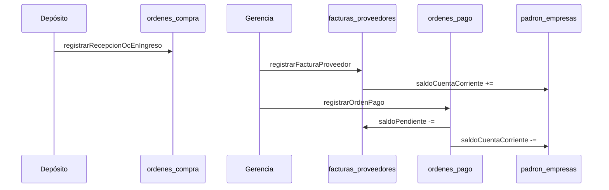

# Módulo B — Tesorería y Cuentas por Pagar

Gestión de deuda con proveedores: facturas legales, órdenes de pago y saldo de cuenta corriente.

**Archivos:** `src/types/tesoreria.ts`, `src/lib/tesoreria.ts`, `firestore.rules`

**Depende de:** Módulo A (`ordenes_compra`, recepción en depósito).

---

## 1. Flujo de negocio completo



---

## 2. Colección `facturas_proveedores`

Función: `registrarFacturaProveedor()` — ver Iteración 3.

Estados: `PENDIENTE_PAGO` → `PAGO_PARCIAL` → `PAGADA` (o `ANULADA`).

---

## 3. Colección `ordenes_pago`

| Campo | Descripción |
|-------|-------------|
| `numero` | Ej. `OP-2026-000015` |
| `proveedorId` / `proveedorNombre` | Proveedor |
| `fechaPago` | Timestamp |
| `montoTotal` | Total emitido |
| `metodoPago` | TRANSFERENCIA, CHEQUE, EFECTIVO |
| `referenciaPago` | Comprobante bancario, CBU, cheque |
| `facturasAplicadas` | `{ facturaId, numeroFactura, montoAplicado }[]` |
| `estado` | EMITIDA, ANULADA |

Numeración: `contadores/numeracion_op` (transaccional).

---

## 4. `registrarOrdenPago` — atomicidad

| Paso | Acción |
|------|--------|
| 1 | Lee proveedor, contador OP y facturas |
| 2 | Valida proveedor, saldos, facturas no anuladas |
| 3 | Valida `montoTotal` = suma imputaciones |
| 4 | Reserva número OP |
| 5 | Crea `ordenes_pago` |
| 6 | Actualiza `saldoPendiente` y estado de cada factura |
| 7 | Reduce `saldoCuentaCorriente` del proveedor |

### Ejemplo

```typescript
await registrarOrdenPago({
  proveedorId: 'empresa_abc',
  fechaPago: new Date(),
  montoTotal: 80000,
  metodoPago: 'TRANSFERENCIA',
  referenciaPago: 'TRX-20260524-0042',
  facturasAplicadas: [
    { facturaId: 'fact_1', montoAplicado: 50000 },
    { facturaId: 'fact_2', montoAplicado: 30000 },
  ],
  usuarioUid: user.uid,
  usuarioNombre: 'Gerencia',
})
```

---

## 5. Reglas Firestore

| Colección | Lectura | Escritura |
|-----------|---------|-----------|
| `ordenes_pago` | gerencia, analista | create/update gerencia |
| `contadores/numeracion_op` | gerencia, analista | create/update gerencia |
| `facturas_proveedores` | gerencia, analista | update gerencia (pagos) |

Despliegue: `firebase deploy --only firestore:rules`

---

## 6. Motor de reversos contables (Iteración 5)

### `anularOrdenPago`

Revoca una OP **EMITIDA** en cascada:

1. Suma cada `montoAplicado` al `saldoPendiente` de la factura.
2. Recalcula estado: `PENDIENTE_PAGO` si saldo = total; `PAGO_PARCIAL` si saldo intermedio.
3. Suma `montoTotal` de la OP al `saldoCuentaCorriente` del proveedor.
4. Marca OP como `ANULADA` con auditoría.

**Orden recomendado:** anular OP antes de anular facturas que recibieron pagos.

### `anularFacturaProveedor`

Regla estricta: **solo si `saldoPendiente === total`** (sin pagos aplicados).

1. Resta `total` del `saldoCuentaCorriente` del proveedor.
2. Elimina clave en `facturas_proveedores_claves` (libera número legal).
3. Resta monto de `montoFacturadoAcumulado` en la OC; si llega a 0 → `facturaCargada = false`.
4. Marca factura `ANULADA` con auditoría.

### Errores adicionales

| Código | Causa |
|--------|-------|
| `YA_ANULADA` | OP o factura ya anulada |
| `FACTURA_CON_PAGOS` | Factura con pagos; anular OP primero |

---

## 7. Roadmap

| Iteración | Entregable |
|-----------|------------|
| 3 | registrarFacturaProveedor ✅ |
| 4 | registrarOrdenPago ✅ |
| 5 | anularOrdenPago + anularFacturaProveedor ✅ |
| 6 | UI gerencia |
