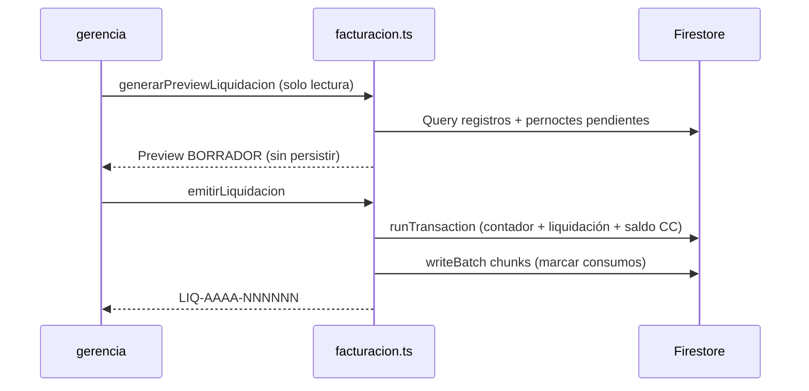

# Módulo C — Cuentas por Cobrar y Liquidaciones a Contratistas

Documento de diseño (Iteración 9): motor de **batch billing** mensual sobre consumos operativos.

**Fuentes:** `src/types/facturacion.ts`, `src/lib/facturacion.ts`, `firestore.rules`.

---

## 1. Contexto de negocio

Las empresas **contratistas** (`padron_empresas` con rol `CONTRATISTA`) consumen servicios registrados en:

| Colección | Qué mide |
|-----------|----------|
| `registros_comedor` | Viandas, desayunos, almuerzos, cenas, etc. |
| `historial_pernoctes` | Noches de hotelería / campamento |

A fin de mes, gerencia agrupa los consumos **no liquidados** de una empresa en un rango de fechas, calcula montos con una **lista de precios** y emite un documento `LiquidacionContratista` (pre-factura).

Al **emitir**, los consumos originales quedan bloqueados (`liquidado: true`, `liquidacionId`) para evitar doble cobro.

---

## 2. Flujo operativo



| Paso | Función | Efecto |
|:----:|---------|--------|
| 1 | `generarPreviewLiquidacion()` | Agrupa y calcula en memoria. Estado `BORRADOR`. **No bloquea** consumos. |
| 2 | `emitirLiquidacion()` | Crea doc `EMITIDA`, incrementa deuda del contratista, marca consumos. |

---

## 3. Esquema — `liquidaciones_contratistas/{id}`

Ver tipos completos en `src/types/facturacion.ts`.

| Campo | Descripción |
|-------|-------------|
| `numero` | `LIQ-2026-000001` (contador `contadores/numeracion_liq`) |
| `empresaId`, `empresaNombre`, `empresaCuit` | Contratista |
| `fechaInicio`, `fechaFin` | Rango inclusive (YYYY-MM-DD) |
| `totalViandas`, `totalNoches` | Resumen de cantidades |
| `detalles[]` | Líneas agrupadas (concepto, cantidad, P.U., subtotal) |
| `subtotalNeto`, `montoIva`, `totalFacturado` | Totales monetarios |
| `estado` | `BORRADOR` \| `EMITIDA` \| `ANULADA` |
| `registrosComedorIds`, `historialPernocteIds` | Auditoría y reintentos de batch |

### Contador

Documento singleton `contadores/numeracion_liq`:

```typescript
interface ContadorNumeracionLiq {
  anio: number
  ultimoSecuencial: number
  actualizadoEn: Timestamp
}
```

---

## 4. Adaptación de consumos existentes

Campos opcionales en `registros_comedor` e `historial_pernoctes`:

```typescript
liquidado?: boolean      // true → incluido en liquidación EMITIDA
liquidacionId?: string   // FK a liquidaciones_contratistas
```

- `undefined` o `false` → pendiente de liquidar.
- Solo gerencia puede marcar estos campos (reglas `gerenciaMarcaConsumoLiquidado`).

---

## 5. Lista de precios

No hay colección persistente en MVP. La UI pasa `ListaPreciosContratista`:

```typescript
interface ListaPreciosContratista {
  netoPorConcepto: Partial<Record<ConceptoLiquidacion, number>>
  alicuotaIvaPct?: number  // default 21
}
```

Conceptos: `DESAYUNO`, `MERIENDA`, `VIANDA`, `ALMUERZO`, `REFRIGERIO_ALMUERZO`, `CENA`, `CENA_NOCHERO`, `NOCHE`.

La clasificación de comedor replica la lógica de `dashboardFacturacion.ts` / `analistaLiquidaciones.ts`.

---

## 6. Batch billing y chunking Firestore

### Límite de Firestore

Cada `writeBatch` admite **máximo 500 operaciones**. Con miles de viandas, una sola transacción no alcanza.

### Estrategia en `emitirLiquidacion()`

1. **`runTransaction`** (atómico, pocos documentos):
   - Reserva número en `numeracion_liq`.
   - Crea `liquidaciones_contratistas/{id}` con estado `EMITIDA`.
   - Actualiza `padron_empresas/{empresaId}.condicionesComerciales.saldoCuentaCorriente` (+ deuda del contratista).

2. **`writeBatch` con chunking** (`BATCH_CHUNK_SIZE = 450`):
   - Por cada `registros_comedor` involucrado: `{ liquidado: true, liquidacionId }`.
   - Por cada `historial_pernoctes` involucrado: idem.
   - Al llegar a 450 ops → `commit()` → nuevo batch.

```typescript
// Pseudocódigo (src/lib/facturacion.ts)
let batch = writeBatch(db)
let ops = 0
for (const id of registrosIds) {
  batch.update(doc(...), { liquidado: true, liquidacionId })
  ops++
  if (ops >= 450) { await batch.commit(); batch = writeBatch(db); ops = 0 }
}
await batch.commit()
```

### Consistencia eventual

Si falla un batch intermedio después del commit transaccional:

- La liquidación **ya existe** y el saldo CC **ya fue actualizado**.
- Los IDs pendientes están en `registrosComedorIds` / `historialPernocteIds` para reintento manual o job de reconciliación (fuera MVP).

### Validaciones de pernoctes

Para evitar liquidar noches de meses futuros:

- Estadía **abierta** (`fechaCheckOut` null) → error `PERNOCTE_ABIERTO`.
- Check-out **posterior** a `fechaFin` → error `PERNOCTE_CRUZA_PERIODO`.

---

## 7. Cuenta corriente del contratista

Se reutiliza `condicionesComerciales.saldoCuentaCorriente` en `padron_empresas`.

| Rol empresa | Significado del saldo positivo |
|-------------|----------------------------------|
| `PROVEEDOR` (Módulo B) | Debemos al proveedor |
| `CONTRATISTA` (Módulo C) | **Nos deben** al comedor |

Al emitir: `saldo += totalFacturado`.

---

## 8. Reglas de seguridad

| Colección / contador | gerencia | analista |
|---------------------|:--------:|:--------:|
| `liquidaciones_contratistas` | R/W (crear, anular) | R |
| `contadores/numeracion_liq` | R/W | R |
| `registros_comedor` | update solo `liquidado`/`liquidacionId` | — |
| `historial_pernoctes` | update solo `liquidado`/`liquidacionId` (+ operativo existente) | — |

Despliegue:

```bash
firebase deploy --only firestore:rules
```

---

## 9. API backend

```typescript
import { getDb } from '../lib/firebase'
import {
  generarPreviewLiquidacion,
  emitirLiquidacion,
} from '../lib/facturacion'

const db = getDb()

// Preview (no persiste)
const preview = await generarPreviewLiquidacion(
  db,
  empresaId,
  '2026-05-01',
  '2026-05-31',
  {
    netoPorConcepto: {
      DESAYUNO: 3500,
      ALMUERZO: 8500,
      NOCHE: 12000,
      VIANDA: 6000,
    },
    alicuotaIvaPct: 21,
  },
)

// Emisión
const result = await emitirLiquidacion(db, {
  empresaId,
  fechaInicio: '2026-05-01',
  fechaFin: '2026-05-31',
  listaPrecios: { /* igual que preview */ },
  usuarioUid: user.uid,
  usuarioNombre: 'Gerencia',
})
// result.numero → "LIQ-2026-000001"
```

---

## 10. Próximos pasos (UI — Iteración 10)

- Pantalla `/control/liquidaciones` con preview + emitir.
- ABM de listas de precios por contrato (persistidas en Firestore).
- Anulación con reversa de saldo y desbloqueo de consumos.
- Índice compuesto `registros_comedor`: `empresa` + `diaOperativo` + `liquidado` (optimización).

---

## 11. Matriz de permisos — Módulo C

| Acción | gerencia | analista |
|--------|:--------:|:--------:|
| Preview liquidación | ✅ | ❌ |
| Emitir liquidación | ✅ | ❌ |
| Leer liquidaciones | ✅ | ✅ |
| Anular liquidación | ✅ (reglas listas; función TS pendiente) | ❌ |
